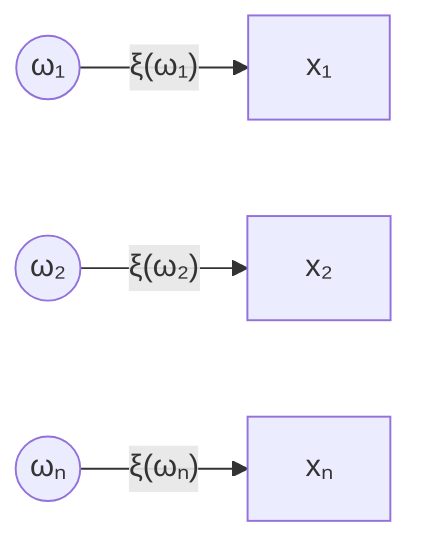

# Математическая модель случайного эксперимента

## §1 Математическая модель случайного эксперимента

### 1.1 Событие

**Элементарные исходы** ($\omega_1, \omega_2, \dots, \omega_n$) — все мыслимые взаимоисключающие результаты опыта / эксперимента / испытания.

**Пространство элементарных исходов** ($\Omega$) — множество всех элементарных исходов данного опыта:
$$\Omega = \{ \omega_1, \omega_2, \dots, \omega_n \}$$

Всякое подмножество пространства элементарных исходов называется **событием**.
То есть $A \subseteq \Omega$ где А – пространство. 

> [!TIP] Пример 1
> **Опыт 1:** Выстрел по мишени.
> $\Omega = \{1, 0\}$, где 1 — попал, 0 — не попал.
>
> **Опыт 2:** Бросание игральной кости.
> $\Omega = \{1, 2, 3, 4, 5, 6\}$.
> Событие $A = \{ \text{выпало число больше чем 3} \} = \{4, 5, 6\}$.
>
> **Опыт 3:** Честное подбрасывание двух правильных монет.
> $\Omega = \{цц, гг, цг, гц\}$, где г — герб, ц — цифра (центр).

### 1.2 Алгебра событий

**Достоверное событие** ($\Omega$) — событие, которое в результате данного опыта обязательно произойдет (содержит все исходы пространства).

**Невозможное событие** ($\varnothing$) — событие, которое в результате данного опыта произойти не может (не содержит ни одного исхода пространства).

**Противоположное событие** ($\bar{A}$) — дополнительное событие, которое ставится в соответствие каждому $A$ и наступает тогда и только тогда, когда событие $A$ не реализуется. Содержит все исходы $\Omega$, которые не входят в $A$.

#### Операции над событиями
- **Сумма двух событий** ($A + B$) — объединение; событие, состоящее в появлении события $A$, или $B$, или их обоих.
- **Произведение** ($AB$) — пересечение; событие, состоящее в одновременном появлении $A$ и $B$.

Операции сложения и умножения событий **коммутативны и ассоциативны**:
$$A + B = B + A, \quad AB = BA$$
$$(A + B) + C = A + (B + C), \quad (AB)C = A(BC)$$

#### Свойства операций (Булева алгебра)
Следующие формулы вводятся как аксиомы:
$$
\begin{aligned}
& A + \varnothing = A & & A \cdot \varnothing = \varnothing \\
& A + \Omega = \Omega & & A \cdot \Omega = A \\
& A + \bar{A} = \Omega & & A \cdot \bar{A} = \varnothing \\
& \bar{\Omega} = \varnothing & & \bar{\varnothing} = \Omega \\
& A + A = A & & A \cdot A = A \\
& \bar{\bar{A}} = A & & \\
& \overline{AB} = \bar{A} + \bar{B} & & \overline{A + B} = \bar{A} \cdot \bar{B} \quad \text{(Законы де Моргана)} \\
& A + (B \cdot C) = (A + B)(A + C) & & A(B + C) = AB + AC \quad \text{(Дистрибутивность)}
\end{aligned}
$$

> [!INFO] Булева алгебра
> Структура, которая образуется на множестве событий введенными определениями и аксиомами.

> [!TIP] Пример 2
> **Опыт:** Два выстрела по мишеням.
> $\Omega = \{11, 10, 01, 00\}$, где 1 — попал, 0 — не попал.
> - Событие $A = \{ \text{попадание при 1-м выстреле} \} = \{11, 10\}$.
> - Событие $B = \{ \text{попадание при 2-м выстреле} \} = \{11, 01\}$.
> - $A + B = \{11, 10, 01\}$ — хотя бы одно попадание.
> - $AB = \{11\}$ — два раза попали.

#### Отношения между событиями
- **Совместные события** $A$ и $B$ — события, появление одного из которых в результате опыта не исключает появление другого.
- **Несовместные события** — взаимоисключающие друг друга события $\Rightarrow$ не содержат общих исходов ($AB = \varnothing$).
- **Событие $A$ влечет событие $B$** ($A \subset B$) — при каждом испытании событие $B$ происходит каждый раз, как только происходит событие $A$.
- **Эквивалентные события** — если $A \subset B$ и $B \subset A \Rightarrow A = B$.
### 1.3 Вероятность

Рассмотрим пространство элементарных исходов $\Omega = \{ \omega_1, \omega_2, \dots, \omega_n \}$.
Каждому исходу поставим в соответствие некоторое число — вероятность $∀ω_i → p_i = P(\omega_i)$, где $p_i \ge 0$.

> [!NOTE] Определение вероятности
> Вероятность события определяется как сумма вероятностей исходов, его составляющих:
> $$P(A) = \sum_{\omega_i \in A} P(\omega_i)$$

#### Аксиомы вероятности
1. $\sum P(\omega_i) = 1$
2. $P(\Omega) = 1$
3. $P(\varnothing) = 0$
4. $0 \le P(A) \le 1$

#### Основные теоремы
- **Теорема сложения:**
  $$P(A + B) = P(A) + P(B) - P(AB)$$
  Для несовместных событий: $P(A + B) = P(A) + P(B)$.
- **Теорема умножения:**
  $$P(AB) = P(A) \cdot P(B|A) = P(B) \cdot P(A|B)$$
- **Вероятность противоположного события:**
  $$P(A) = 1 - P(\bar{A})$$
- **Свойство монотонности:**
  Если $A \subset B$, то $P(A) \le P(B)$.

#### Условная вероятность
$P(A|B)$ — вероятность события $A$ при условии, что событие $B$ произошло.
$$P(A|B) = \frac{P(AB)}{P(B)}, \quad P(B) > 0$$

> [!NOTE] Независимые события
> Событие $A$ не зависит от $B$, если $P(A|B) = P(A)$.
> Для независимых событий выполняется:
> $$P(AB) = P(A) \cdot P(B)$$

#### Полная группа событий
Несколько событий образуют **полную группу**, если в результате опыта обязательно появится хотя бы одно из них (сумма их вероятностей равна 1).
> [!TIP] Пример 4
> Опыт: 2 выстрела в мишень.
> 
> $\Omega = {11, 10, 01, 00}$
> 
> $A = {ниодного попадания} = {00}$
> 
> B = \{одно попадание\} = \{01, 10\}
> 
> C = \{никто не попал\} = \{11\}; 
> ABC - образуют полную группу
> 
> $A + B + C = \Omega$ , даже если есть повторы.

#### Способы задания вероятностей
1. **Аксиоматический** (базовое определение).
2. **Классический** (равновозможные исходы):
   $$P(A) = \frac{m}{n}$$
   где $m$ — число благоприятных исходов, $n$ — общее число исходов.
3. **Геометрический** (непрерывное пространство):
   - Для длин: $P = \frac{l}{L}$
   - Для площадей: $P = \frac{S_g}{S_G}$
   ![[Pasted image 20260314203054.png]]	![[Pasted image 20260314203114.png|453]]
   **Рисунок 1:** Геометрическая вероятность на отрезке и площади.
4. **Статистический** (на основе опытов):
   Частота события $w(A) = \frac{m}{n}$, где $n$ — число опытов, $m$ — число появлений $A$.
   При больших $n$: $P(A) \approx w(A)$.

> [!TIP] Пример из лекции (Статистический подход)
> | Всего опытов | Появления герба | Частота |
> | :---: | :---: | :---: |
> | 4040 | 2048 | 0.5069 |
> | 12000 | 6019 | 0.5016 |
> | 24000 | 12012 | 0.5005 |
> *При увеличении числа опытов частота стабилизируется вокруг 0.5.*

> [!TIP] Пример 6 (Геометрическая вероятность)
> **Задача о встрече:** Два друга условились встретиться в определённом месте в течение часа.
>![[Pasted image 20260314203353.png]]
> **Дано:**
> - $x$ — время прихода Васи (в долях часа, $0 \le x \le 1$)
> - $y$ — время прихода Фёдора (в долях часа, $0 \le y \le 1$)
> - Пространство исходов: $\Omega = \{(x, y) \in \mathbb{R}^2 \mid 0 \le x \le 1, \ 0 \le y \le 1\}$
> - Условие встречи: $|x - y| \le \frac{1}{4}$ (ждут друг друга не более 15 минут)
>
> **Благоприятная область:**
> $$A = \left\{(x, y) \in \Omega \ \middle|\ |x - y| \le \frac{1}{4}\right\}$$
> $$\frac{1}{4} + x \ge y \ge x - \frac{1}{4}$$
>
> **Решение:**
> - Площадь всего пространства: $S(\Omega) = 1 \cdot 1 = 1$
> - Площадь благоприятной области: $S(A) = 1 - 2 \cdot \frac{1}{2} \cdot \left(\frac{3}{4}\right)^2 = 1 - \frac{9}{16} = \frac{7}{16}$
>
> **Ответ:** $P(A) = \frac{S(A)}{S(\Omega)} = \frac{7}{16} \approx 0.4375$
### 1.4 Формула полной вероятности и Байеса

#### Формула полной вероятности (**ДО ОПЫТА**)
Пусть $H_1, H_2, \dots, H_n$ — **полная группа несовместных событий** (гипотез).
Событие $A$ может произойти только вместе с одной из гипотез.

$$P(A) = \sum_{i=1}^{n} P(H_i) \cdot P(A|H_i)$$
> [!TIP] Пример 7 (Формула полной вероятности)
> **Задача:** В ящике 8 зелёных, 10 жёлтых и 7 белых шаров.
> - Среди зелёных — 2 с дефектом
> - Среди жёлтых — 4 с дефектом
> - Среди белых — 1 с дефектом
>
> Наудачу выбирают 1 шар. Найти вероятность того, что шар с дефектом.
>
> **Решение:**
>
> **Гипотезы:**
> - $H_1 = \{\text{зелёный шар}\}$
> - $H_2 = \{\text{жёлтый шар}\}$
> - $H_3 = \{\text{белый шар}\}$
>
> **Вероятности гипотез:**
> $$P(H_1) = \frac{8}{25}, \quad P(H_2) = \frac{10}{25}, \quad P(H_3) = \frac{7}{25}$$
> $$\sum P(H_i) = 1 \quad \checkmark$$
>
> **Событие:** $A = \{\text{появление шара с дефектом}\}$
>
> **Условные вероятности:**
> $$P(A|H_1) = \frac{2}{8} = \frac{1}{4}$$
> $$P(A|H_2) = \frac{4}{10} = \frac{2}{5}$$
> $$P(A|H_3) = \frac{1}{7}$$
>
> **По формуле полной вероятности:**
> $$P(A) = P(H_1) \cdot P(A|H_1) + P(H_2) \cdot P(A|H_2) + P(H_3) \cdot P(A|H_3)$$
> $$P(A) = \frac{8}{25} \cdot \frac{1}{4} + \frac{10}{25} \cdot \frac{2}{5} + \frac{7}{25} \cdot \frac{1}{7}$$
> $$P(A) = \frac{2}{25} + \frac{4}{25} + \frac{1}{25} = \frac{7}{25} = 0.28$$
>
> **Ответ:** $P(A) = \frac{7}{25}$
> 
#### Формула Байеса (ПОСЛЕ ОПЫТА)
Пусть $H_1, H_2, \dots, H_n$ — **полная группа несовместных событий** (гипотез).
Если опыт произведён и событие $A$ наступило, вероятности гипотез переоцениваются:

$$P(H_i|A) = \frac{P(H_i) \cdot P(A|H_i)}{P(A)}$$

где $P(A)$ вычисляется по формуле полной вероятности.

> [!TIP] Пример 7
> **Задача:** Изделия поступают от трёх поставщиков.
> - Поставщик 1: 50% изделий, брак 2%
> - Поставщик 2: 30% изделий, брак 3%
> - Поставщик 3: 20% изделий, брак 4%
>
> **Найти:** Вероятность того, что бракованное изделие поступило от поставщика 1.
> $$P(H_1|A) = \frac{0.5 \cdot 0.02}{0.5 \cdot 0.02 + 0.3 \cdot 0.03 + 0.2 \cdot 0.04} \approx 0.37$$

### Схема Бернулли

Если производится $n$ **независимых испытаний**, в каждом из которых событие может появится/не появится и $P(A) = p = \text{const}$, то вероятность того, что $A$ наступит ровно $k$ раз:

$$P_n(k) = C_n^k \cdot p^k \cdot q^{n-k}, \quad \text{где } q = 1 - p$$

**Наивероятнейшее число** $m_0$ определяется из неравенства:
$$np - q \le m_0 \le np + p$$

#### Приближённые формулы

| Условия             | Формула                                                                                                                    | Название                            |
| :------------------ | :------------------------------------------------------------------------------------------------------------------------- | :---------------------------------- |
| $npq > 9$           | $$P_{n}(K)\approx\frac{1}{\sqrt{npq}}\cdot\frac{1}{\sqrt{2\pi}}e^{-\frac{x^{2}}{2}};x=\frac{k-np}{\sqrt{npq}}.$$           | Локальная теорема Муавра-Лапласа    |
| $npq > 9$           | $$P_n(k_1 < k < k_2) \approx \Phi\left(\frac{k_2 - np}{\sqrt{npq}}\right) - \Phi\left(\frac{k_1 - np}{\sqrt{npq}}\right)$$ | Интегральная теорема Муавра-Лапласа |
| $npq < 9$, $p$ мало | $$P_n(k) \approx \frac{np^k e^{-np}}{k!}$$                                                                                 | Формула Пуассона                    |
> [!TIP] Пример 9 (Формула Бернулли)
> **Задача:** Вероятность изготовления на автоматическом станке стандартной детали = 0.8.
> Найти вероятности возможного числа бракованных деталей среди 5 деталей.
>
> **Решение:**
>
> **Дано:**
> - $n = 5$ (число испытаний)
> - $p = 0.2$ (вероятность появления бракованной детали)
> - $q = 1 - p = 0.8$ (вероятность появления стандартной детали)
> - $k = 0, 1, 2, 3, 4, 5$ (возможное число бракованных деталей)
>
> **Событие:** $A = \{\text{появление брака}\}$
>
> **По формуле Бернулли:**
> $$P_n(k) = C_n^k \cdot p^k \cdot q^{n-k}$$
>
> **Расчёт вероятностей:**
> - $P_5(0) = C_5^0 \cdot 0.2^0 \cdot 0.8^5 = 1 \cdot 1 \cdot 0.32768 = 0.32768$
> - $P_5(1) = C_5^1 \cdot 0.2^1 \cdot 0.8^4 = 5 \cdot 0.2 \cdot 0.4096 = 0.4096$
> - $P_5(2) = C_5^2 \cdot 0.2^2 \cdot 0.8^3 = 10 \cdot 0.04 \cdot 0.512 = 0.2048$
> - $P_5(3) = C_5^3 \cdot 0.2^3 \cdot 0.8^2 = 10 \cdot 0.008 \cdot 0.64 = 0.0512$
> - $P_5(4) = C_5^4 \cdot 0.2^4 \cdot 0.8^1 = 5 \cdot 0.0016 \cdot 0.8 = 0.0064$
> - $P_5(5) = C_5^5 \cdot 0.2^5 \cdot 0.8^0 = 1 \cdot 0.00032 \cdot 1 = 0.00032$
>
> **Контроль:** $\sum P_5(k) = 0.32768 + 0.4096 + 0.2048 + 0.0512 + 0.0064 + 0.00032 = 1$ ✓
>
> **Ряд распределения:**
>
> | $k$ (число брака) | 0 | 1 | 2 | 3 | 4 | 5 |
> | :---: | :---: | :---: | :---: | :---: | :---: | :---: |
> | $P_5(k)$ | 0.32768 | 0.4096 | 0.2048 | 0.0512 | 0.0064 | 0.00032 |
>
> **Ответ:** Вероятности рассчитаны выше.
 
## §2 Случайные величины

**Случайная величина** ($\xi$) — функция $\xi(\omega)$, определённая на пространстве элементарных исходов $\Omega$ и принимающая числовые значения.

> [!INFO] Типы случайных величин
> 1. **Дискретные** — множество значений конечно или счётно
> 2. **Непрерывные** — функция распределения непрерывна

### Схема отображения исходов в значения СВ

### Примеры случайных величин

1. Количество родившихся мальчиков среди 100 новорождённых
2. Расстояние, которое пролетит снаряд при выстреле
3. Время ожидания транспорта
4. Курс доллара

**Значения случайной величины:** $x_1, x_2, \dots, x_n, \dots$

Если данному эксперименту соответствует большое количество элементарных исходов, то проще перейти к случайной величине.

Рассмотрим подмножество пространства $\Omega$:
$$\{\xi = x_i\} = \{\omega : \omega \in \Omega, \xi(\omega) = x_i\} \quad \text{— событие}$$

$$P(\{\xi = x_i\}) = p_i$$

События $\{\xi = x_1\}, \{\xi = x_2\}, \dots, \{\xi = x_n\}, \dots$ образуют **полную группу несовместных событий**.

Следовательно:
$$p_1 + p_2 + \dots + p_n = 1$$

> [!INFO] Закон распределения
> Закон распределения случайной величины — всякое соотношение, устанавливающее связь между возможными значениями случайной величины и соответствующими им вероятностями.

**Многоугольник распределения** — ломаная с вершинами в точках $(x_i; p_i)$.

> [!TIP] Пример 1 (Двукратное подбрасывание монеты)
> **Опыт:** Монету подбрасывают дважды.
> 
> **Случайная величина:** $\xi$ — число выпавших гербов.
> 
> **Пространство исходов:** $\Omega = \{\Gamma\Gamma, \Gamma\text{Ц}, \text{Ц}\Gamma, \text{Ц}\text{Ц}\}$
> 
> | $\omega_i$ | $\Gamma\Gamma$ | $\Gamma\text{Ц}$ | $\text{Ц}\Gamma$ | $\text{Ц}\text{Ц}$ |
> | :---: | :---: | :---: | :---: | :---: |
> | $x_i$ | 2 | 1 | 1 | 0 |
> 
> $\xi$ принимает значения: $0, 1, 2$
> 
> **Расчёт вероятностей:**
> - $P_1(\xi = 0) = P(\text{Ц}\text{Ц}) = \frac{1}{4}$
> - $P_2(\xi = 1) = P(\Gamma\text{Ц}, \text{Ц}\Gamma) = \frac{2}{4} = \frac{1}{2}$
> - $P_3(\xi = 2) = P(\Gamma\Gamma) = \frac{1}{4}$
> 
> **Контроль:** $\sum_{i=1}^{3} P_i = 1$ ✓
> 
> **Ряд распределения:**
> 
> | $x_i$ | 0 | 1 | 2 |
> | :---: | :---: | :---: | :---: |
> | $p_i$ | $\frac{1}{4}$ | $\frac{1}{2}$ | $\frac{1}{4}$ |
### Функция распределения $F(x)$

**Определение:** Функцией распределения случайной величины $\xi$ называется функция $F(x)$, выражающая вероятность того, что случайная величина примет значение, меньшее $x$:

$$F(x) = P(\xi < x)$$
![[Pasted image 20260314205020.png|642]]
#### Свойства функции распределения
1. **Область определения:** $x \in (-\infty; +\infty)$
2. **Область значений:** $F(x) \in [0; 1]$ значит ограниченная
3. **Неубывающая:** если $x_1 < x_2$, то $F(x_1) \le F(x_2)$
4. **Предельные значения:**
   $$F(-\infty) = \lim_{x \to -\infty} F(x) = 0$$
   $$F(+\infty) = \lim_{x \to +\infty} F(x) = 1$$
$$0 ≤ F(x) ≤ 1$$
5. **Вероятность попадания в интервал равна приращению функции:**
   $$P(\alpha \le \xi < \beta) = F(\beta) - F(\alpha)$$
> [!TIP] Пример 2 (Построение функции распределения)
> **Задача:** Найти функцию распределения $F(x)$ дискретной случайной величины $\xi$ — числа выпавших гербов при двукратном подбрасывании монеты.
>![[Pasted image 20260314205420.png]]
> **Дано:**
> - $P(\xi = 0) = \frac{1}{4}$ (нет гербов — ЦЦ)
> - $P(\xi = 1) = \frac{1}{2}$ (один герб — ГЦ или ЦГ)
> - $P(\xi = 2) = \frac{1}{4}$ (два герба — ГГ)
>
> **Решение:**
>
> Функция распределения определяется как $F(x) = P(\xi < x)$.
>
> **1.** При $x \in (-\infty; 0]$:
> $$F(x) = P(\xi < x) = 0$$
>
> **2.** При $x \in (0; 1]$:
> $$F(x) = P(\xi < x) = P(\xi = 0) = \frac{1}{4}$$
>
> **3.** При $x \in (1; 2]$:
> $$F(x) = P(\xi < x) = P(\xi = 0) + P(\xi = 1) = \frac{1}{4} + \frac{1}{2} = \frac{3}{4}$$
>
> **4.** При $x \in [2; +\infty)$:
> $$F(x) = P(\xi < x) = P(\xi = 0) + P(\xi = 1) + P(\xi = 2) = \frac{1}{4} + \frac{1}{2} + \frac{1}{4} = 1$$
>
> **Ответ:**
> $$F(x) = \begin{cases} 
> 0 & , x \le 0 \\
> \frac{1}{4} & , 0 < x \le 1 \\
> \frac{3}{4} & , 1 < x \le 2 \\
> 1 & , x > 2 
> \end{cases}$$
>
> 
### Способы задания законов распределения

#### Случайная величина дискретного типа (СВ ДТ)

1. **Ряд распределения** (таблица)
   
| $x_i$ | $x_1$ | $x_2$ | $\dots$ | $x_n$ |
| :---: | :---: | :---: | :---: | :---: |
| $p_i$ | $p_1$ | $p_2$ | $\dots$ | $p_n$ |
	где $\sum_{i=1}^{n} p_i = 1$

2. **Формула**
$$P(\xi = x_i) = f(i), \quad i = 1, 2, \dots, n$$

3. **Многоугольник распределения**
   
   Ломаная с вершинами в точках $(x_i; p_i)$.

4. **Функция распределения** (интегральная)
   $$F(x) = P(\xi < x) = \sum_{x_i < x} p_i$$

#### Случайная величина непрерывного типа (СВ НТ)

1. **Формула распределения** (интегральная)
   
   Функция распределения:
   $$F(x) = P(\xi < x)$$

2. **Функция плотности распределения** (дифференциальная)
   $$f(x) = F'(x)$$
   
   Свойства:
   - $f(x) \ge 0$
   - $\int_{-\infty}^{+\infty} f(x) \, dx = 1$
   - $F(x) = \int_{-\infty}^{x} f(t) \, dt$
   - $P(\alpha < \xi < \beta) = \int_{\alpha}^{\beta} f(x) \, dx$

> [!INFO] Основное различие
> - **Дискретная СВ:** задаётся рядом распределения (таблицей), многоугольником распределения
> - **Непрерывная СВ:** задаётся функцией плотности распределения $f(x)$ или функцией распределения $F(x)$

> [!IMPORTANT] Вероятность отдельного значения непрерывной СВ
> Вероятность любого отдельно взятого значения случайной величины непрерывного типа равна **0**.
>
> Это означает, что для непрерывной случайной величины:
> $$P(\xi = a) = 0 \quad \text{для любого } a$$
> > [!INFO] Геометрический смысл
> > Вероятность равна площади под кривой плотности. Площадь под кривой в одной точке равна нулю (нет ширины).

> [!NOTE] Для непрерывных СВ
> Вероятность попадания в промежуток не зависит от того, является он закрытым или открытым:
> $$P(\alpha \le \xi \le \beta) = P(\alpha < \xi < \beta) = P(\alpha \le \xi < \beta) = P(\alpha < \xi \le \beta)$$
> Вероятность любого отдельно взятого значения непрерывной СВ равна нулю.

### Плотность распределения (для непрерывных СВ)

**Определение:** Плотностью распределения случайной величины $\xi$ непрерывного типа называется функция, равная производной её функции распределения:

$$f(x) = F'(x)$$

(дифференциальный закон распределения)

#### Свойства плотности распределения только для непрерывных
1. **Неотрицательность:** $f(x) \ge 0$
т. к. $F(x)$– неубывающая функция следовательно ее производная положительна или равна 0. 
$D(f)=(-\infty;+\infty);E(f)=[0;+\infty)$
2. **Нормировка:**
   $$\int_{-\infty}^{+\infty} f(x) \, dx = 1$$
3. **Связь с функцией распределения:**
![[Pasted image 20260316221524.png]]
   $$F(x) = \int_{-\infty}^{x} f(t) \, dt$$
4. **Вероятность попадания в интервал:**
   $$P(a < \xi < b) = \int_{a}^{b} f(x) \, dx$$

> [!INFO] Геометрический смысл
> Полный объём тела, ограниченного графиком функции $f(x, y)$ сверху и плоскостью $XOY$, равен 1. Для одномерного случая — площадь под кривой плотности равна 1.

> [!TIP] Пример 1.1 (Непрерывная случайная величина)
> **Дано:** Функция распределения непрерывной случайной величины:
> $$F(x) = \begin{cases} 
> 0 & , x \le 0 \\
> ax^2 & , 0 \le x \le 1 \\
> 1 & , x > 1 
> \end{cases}$$
>
> **Найти:** 
> 1. Параметр $a$
> 2. Плотность распределения $f(x)$
> 3. Вероятность $P(0.2 < \xi < 0.5)$
> 4. Построить графики
>
> **Решение:**
>
> **1. Нахождение параметра $a$:**
>
> Функция распределения должна быть непрерывной. В точке $x = 1$:
> $$\lim_{x \to 1-0} F(x) = \lim_{x \to 1+0} F(x) = F(1)$$
> $$a \cdot 1^2 = 1 \Rightarrow a = 1$$
>
> **Проверка в точке $x = 0$:**
> $$\lim_{x \to -0} F(x) = \lim_{x \to +0} F(x) = F(0)$$
> $$0 = a \cdot 0^2 = 0 \quad \checkmark$$
>
> **2. Функция распределения:**
> $$F(x) = \begin{cases} 
> 0 & , x \le 0 \\
> x^2 & , 0 < x \le 1 \\
> 1 & , x > 1 
> \end{cases}$$
>
> **3. Плотность распределения:**
> $$f(x) = F'(x) = \begin{cases} 
> 0 & , x \le 0 \\
> 2x & , 0 < x \le 1 \\
> 0 & , x > 1 
> \end{cases}$$
>
> **4. Вероятность попадания в интервал:**
> $$P(0.2 < \xi < 0.5) = F(0.5)-$$$$ - F(0.2) = 0.5^2 - 0.2^2 = 0.25 - 0.04 = 0.21$$
>
> **Ответ:** $a = 1$, $f(x) = \begin{cases} 0, & x \le 0 \\ 2x, & 0 < x \le 1 \\ 0, & x > 1 \end{cases}$, $P(0.2 < \xi < 0.5) = 0.21$
>![[Pasted image 20260316222125.png]]
> **Рисунок 10:** Графики функции распределения $F(x)$ и плотности $f(x)$.

> [!TIP] Пример 1.2 (Непрерывная случайная величина с косинусоидальной плотностью)
> **Дано:** Плотность распределения непрерывной случайной величины:
> $$f(x) = \begin{cases} 
> a\cos x & , x \in \left[-\frac{\pi}{2}, \frac{\pi}{2}\right] \\
> 0 & , x \notin \left[-\frac{\pi}{2}, \frac{\pi}{2}\right] 
> \end{cases}$$
>
> **Найти:** 
> 1. Параметр $a$
> 2. Функцию распределения $F(x)$
> 3. Вероятность $P\left(0 < \xi < \frac{\pi}{4}\right)$
> 4. Построить графики $f(x)$ и $F(x)$
>
> **Решение:**
>
> **1. Нахождение параметра $a$:**
>
> Используем свойство нормировки плотности:
> $$\int_{-\infty}^{+\infty} f(x) \, dx = 1$$
>![[Pasted image 20260316222459.png]]
> $$\int_{-\infty}^{+\infty} f(x) \, dx = \int_{-\infty}^{-\pi/2} 0 \, dx + \int_{-\pi/2}^{\pi/2} a\cos x \, dx + \int_{\pi/2}^{+\infty} 0 \, dx = 1$$
>
> $$\int_{-\pi/2}^{\pi/2} a\cos x \, dx = a\sin(x)\Big|_{-\pi/2}^{\pi/2} = a\left[\sin\left(\frac{\pi}{2}\right) - \sin\left(-\frac{\pi}{2}\right)\right] = a(1 + 1) = 2a$$
>
> $$2a = 1 \Rightarrow a = \frac{1}{2}$$
>
> **2. Плотность распределения:**
> $$f(x) = \begin{cases} 
> 0 & , x < -\frac{\pi}{2} \\
> \frac{1}{2}\cos x & , -\frac{\pi}{2} \le x \le \frac{\pi}{2} \\
> 0 & , x > \frac{\pi}{2} 
> \end{cases}$$
>
> **3. Функция распределения $F(x) = \int_{-\infty}^{x} f(t) \, dt$:**
>
> **Случай 1:** $x \in \left(-\infty, -\frac{\pi}{2}\right)$
> $$F(x) = \int_{-\infty}^{x} 0 \, dt = 0$$
>![[Pasted image 20260316222559.png]]
> **Случай 2:** $x \in \left[-\frac{\pi}{2}, \frac{\pi}{2}\right]$
> $$F(x) = \int_{-\infty}^{-\pi/2} 0 \, dt + \int_{-\pi/2}^{x} \frac{1}{2}\cos t \, dt = \frac{1}{2}\sin t\Big|_{-\pi/2}^{x} = \frac{1}{2}\left(\sin x + 1\right)$$
>![[Pasted image 20260316222606.png]]
> **Случай 3:** $x \in \left(\frac{\pi}{2}, +\infty\right)$
> $$F(x) = \int_{-\infty}^{\pi/2} f(t) \, dt = 1$$
>![[Pasted image 20260316222614.png]]
> **Итоговая функция распределения:**
> $$F(x) = \begin{cases} 
> 0 & , x < -\frac{\pi}{2} \\
> \frac{1}{2}(\sin x + 1) & , -\frac{\pi}{2} \le x \le \frac{\pi}{2} \\
> 1 & , x > \frac{\pi}{2} 
> \end{cases}$$
>
> **4. Вероятность попадания в интервал:**
> $$P\left(0 < \xi < \frac{\pi}{4}\right) = F\left(\frac{\pi}{4}\right) - F(0)$$
> $$F\left(\frac{\pi}{4}\right) = \frac{1}{2}\left(\sin\frac{\pi}{4} + 1\right) = \frac{1}{2}\left(\frac{\sqrt{2}}{2} + 1\right)$$
> $$F(0) = \frac{1}{2}(\sin 0 + 1) = \frac{1}{2}$$
> $$P\left(0 < \xi < \frac{\pi}{4}\right) = \frac{1}{2}\left(\frac{\sqrt{2}}{2} + 1\right) - \frac{1}{2} = \frac{\sqrt{2}}{4}$$
>
> **Ответ:** $a = \frac{1}{2}$, $F(x) = \begin{cases} 0, & x < -\frac{\pi}{2} \\ \frac{1}{2}(\sin x + 1), & -\frac{\pi}{2} \le x \le \frac{\pi}{2} \\ 1, & x > \frac{\pi}{2} \end{cases}$, $P\left(0 < \xi < \frac{\pi}{4}\right) = \frac{\sqrt{2}}{4}$
>

## §3 Числовые характеристики 
### 3.1 Характеристики положения

Характеризуют положение случайной величины на числовой оси, указывают некоторое среднее значение, около которого группируются все возможные значения СВ.

#### Математическое ожидание $M[\xi]$ (среднее значение)

**Для дискретной СВ:**
$$M[\xi] = \sum_{i=1}^{\infty} x_i p_i$$

**Для непрерывной СВ:**
$$M[\xi] = \int_{-\infty}^{+\infty} x f(x) \, dx$$

#### Мода ($m_0$)

  

**Для дискретной СВ:** наиболее вероятное значение, для которого:

$$P(\xi = m_0) = \max_i P(\xi = x_i)$$

**Для непрерывной СВ:** точка максимума функции плотности распределения $f(x)$.

> [!INFO] Мода
> Мода — наиболее вероятное значение случайной величины.

> [!NOTE] Унимодальное и мультимодальное распределение
> - Мода **может существовать**, а **может отсутствовать**!
> - Если мода **одна** — распределение называется **унимодальным**
> - Если мод **несколько** — распределение называется **мультимодальным**
#### Медиана ($m_e$)

Значение непрерывной случайной величины, для которого выполняется:
$$P(\xi < m_e) = P(\xi \ge m_e)$$

Или через функцию распределения:
$$F(m_e) = 0.5$$
![[Pasted image 20260316222940.png]]

> [!TIP] Пример 5 (Числовые характеристики)
> **Часть 1: Дискретная случайная величина** (из Примера 1, Лекция 2, §2)
>
> **Дано:** Ряд распределения случайной величины $\xi$ — числа выпавших гербов при двукратном подбрасывании монеты:
>
> | $x_i$ | 0 | 1 | 2 |
> | :---: | :---: | :---: | :---: |
> | $p_i$ | $\frac{1}{4}$ | $\frac{1}{2}$ | $\frac{1}{4}$ |
>
> **Найти числовые характеристики:**
>
> **1. Математическое ожидание:**
> $$M[\xi] = 0 \cdot \frac{1}{4} + 1 \cdot \frac{1}{2} + 2 \cdot \frac{1}{4} = 0 + \frac{1}{2} + \frac{1}{2} = 1$$
>
> **2. Мода:**
> $$m_0 = 1 \quad \text{(наиболее вероятное значение)}$$
>
> **3. Дисперсия:**
> $$D[\xi] = \alpha_2 - (M[\xi])^2$$
> $$\alpha_2 = 0^2 \cdot \frac{1}{4} + 1^2 \cdot \frac{1}{2} + 2^2 \cdot \frac{1}{4} = 0 + \frac{1}{2} + 1 = \frac{3}{2}$$
> $$D[\xi] = \frac{3}{2} - 1^2 = \frac{3}{2} - 1 = \frac{1}{2}$$
>
> **4. Среднее квадратическое отклонение:**
> $$\sigma[\xi] = \sqrt{D[\xi]} = \sqrt{\frac{1}{2}} = \frac{\sqrt{2}}{2} \approx 0.707$$
>
> **5. Медиана:**
> $$m_e = 1 \quad \text{(т.к. } F(1) = P(\xi < 1) = \frac{1}{4} + \frac{1}{2} = \frac{3}{4} > 0.5\text{)}$$
>
> 
>
> **Часть 2: Непрерывная случайная величина**
>
> **Дано:** Плотность распределения:
> $$f(x) = \begin{cases} 
> 0 & , x \le 0 \\
> 2x & , 0 < x \le 1 \\
> 0 & , x > 1 
> \end{cases}$$
>
> **Найти числовые характеристики:**
>
> **1. Математическое ожидание:**
> $$M[\xi] = \int_{-\infty}^{+\infty} x f(x) \, dx = \int_{0}^{1} x \cdot 2x \, dx = 2 \int_{0}^{1} x^2 \, dx = 2 \cdot \frac{x^3}{3} \Big|_{0}^{1} = \frac{2}{3}$$
>
> **2. Мода:**
> $$m_0 = 1 \quad \text{(точка максимума плотности } f(x) = 2x\text{)}$$
>
> **3. Дисперсия:** *(самостоятельно)*
> $$D[\xi] = \alpha_2 - (M[\xi])^2$$
> $$\alpha_2 = \int_{-\infty}^{+\infty} x^2 f(x) \, dx = \int_{0}^{1} x^2 \cdot 2x \, dx = 2 \int_{0}^{1} x^3 \, dx = 2 \cdot \frac{x^4}{4} \Big|_{0}^{1} = \frac{1}{2}$$
> $$D[\xi] = \frac{1}{2} - \left(\frac{2}{3}\right)^2 = \frac{1}{2} - \frac{4}{9} = \frac{9}{18} - \frac{8}{18} = \frac{1}{18}$$
>
> **4. Среднее квадратическое отклонение:** *(самостоятельно)*
> $$\sigma[\xi] = \sqrt{D[\xi]} = \sqrt{\frac{1}{18}} = \frac{1}{3\sqrt{2}} = \frac{\sqrt{2}}{6} \approx 0.236$$
>
> **5. Медиана:** *(самостоятельно)*
> $$F(m_e) = 0.5$$
> $$F(x) = \int_{0}^{x} 2t \, dt = t^2 \Big|_{0}^{x} = x^2$$
> $$m_e^2 = 0.5 \Rightarrow m_e = \sqrt{0.5} = \frac{\sqrt{2}}{2} \approx 0.707$$
### 3.2 Характеристики рассеивания

Дают представление о том, как сильно могут отклоняться от своего центра группирования значения СВ.

#### Дисперсия $D[\xi]$

Определение для дискретной СВ:**
$$D[\xi] = \sum_{i=1}^{\infty} (x_i - M[\xi])^2 p_i$$

**Определение для непрерывной СВ:**
$$D[\xi] = \int_{-\infty}^{+\infty} (x - M[\xi])^2 f(x) \, dx$$

**Формула для вычисления:**
$$D[\xi] = \alpha_2 - (M[\xi])^2$$

#### Среднее квадратическое отклонение

$$\sigma[\xi] = \sqrt{D[\xi]}$$
$$ u-c_{j}\geq d_{j}^{\infty};$$

$\Sigma$ и $\int$ – сходятся тогда дисперсия существует, иначе не имеет насколько близко от мат. ожидания
### 3.3 Моменты

#### Начальный момент $k$-го порядка
- Для дискретной: $$\alpha_k = \sum_{i=1}^{\infty} x_i^k p_i$$
- Для непрерывной: $$\alpha_k = \int_{-\infty}^{+\infty} x^k f(x) \, dx$$
#### Центральный момент $k$-го порядка

$$\mu_k = M[(\xi - M[\xi])^k]$$

- Для дискретной: $\mu_k = \sum_{i=1}^{\infty} (x_i - M[\xi])^k p_i$
- Для непрерывной: $\mu_k = \int_{-\infty}^{+\infty} (x - M[\xi])^k f(x) \, dx$

#### Частные случаи

| Момент     | Обозначение | Смысл                       |
| :--------- | :---------- | :-------------------------- |
| $\alpha_1$ | $M[\xi]$    | Математическое ожидание     |
| $\mu_2$    | $D[\xi]$    | Дисперсия                   |
| $\mu_3$    | —           | Для коэффициента асимметрии |
| $\mu_4$    | —           | Для эксцесса                |

#### Коэффициент асимметрии и эксцесс

**Коэффициент асимметрии:**
$$A[\xi] = \frac{\mu_3}{\sigma^3}$$

**Эксцесс:**
$$E[\xi] = \frac{\mu_4}{\sigma^4} - 3$$
![[Pasted image 20260316224314.png]]
![[Pasted image 20260316224320.png|581]]
> [!NOTE] Интерпретация
> - $A = 0$ — симметричное распределение
> - $A > 0$ — правосторонняя асимметрия
> - $A < 0$ — левосторонняя асимметрия
> - $E = 0$ — нормальное распределение (по эксцессу)
> - $E > 0$ — островершинное распределение
> - $E < 0$ — плосковершинное распределение
****

> [!TIP] Пример 2 (Расчёт дисперсии дискретной СВ)
> **Дано:** Ряд распределения случайной величины $\xi$:
>
> | $x_i$ | 0 | 1 | 2 |
> | :---: | :---: | :---: | :---: |
> | $p_i$ | $\frac{1}{4}$ | $\frac{1}{2}$ | $\frac{1}{4}$ |
>
> **Найти:** Дисперсию $D[\xi]$
>
> **Решение:**
>
> **1. Нахождение математического ожидания:**
> $$M[\xi] = 0 \cdot \frac{1}{4} + 1 \cdot \frac{1}{2} + 2 \cdot \frac{1}{4} = 0 + \frac{1}{2} + \frac{1}{2} = 1$$
>
> **2. Расчёт дисперсии по определению:**
> $$D[\xi] = M[(\xi - M[\xi])^2] = \sum_{i=1}^{n} (x_i - M[\xi])^2 \cdot p_i$$
> $$D[\xi] = (0-1)^2 \cdot \frac{1}{4} + (1-1)^2 \cdot \frac{1}{2} + (2-1)^2 \cdot \frac{1}{4}$$
> $$D[\xi] = 1 \cdot \frac{1}{4} + 0 \cdot \frac{1}{2} + 1 \cdot \frac{1}{4} = \frac{1}{4} + 0 + \frac{1}{4} = \frac{1}{2}$$
>
> **3. Расчёт дисперсии по формуле:**
> $$D[\xi] = \alpha_2 - (M[\xi])^2$$
> $$\alpha_2 = 0^2 \cdot \frac{1}{4} + 1^2 \cdot \frac{1}{2} + 2^2 \cdot \frac{1}{4} = 0 + \frac{1}{2} + 1 = \frac{3}{2}$$
> $$D[\xi] = \frac{3}{2} - 1^2 = \frac{3}{2} - 1 = \frac{1}{2}$$
>
> **Ответ:** $D[\xi] = \frac{1}{2}$
>
## §4 Основные распределения и их числовые характеристики

### 4.1 Биномиальное распределение

**Случайная величина дискретного типа**, принимает значения:
$$k = 0, 1, 2, \dots, n$$

С вероятностями:
$$P_n(k) = C_n^k \cdot p^k \cdot q^{n-k}, \quad \text{где } q = 1 - p$$

#### Ряд распределения

| $X$ | $0$ | $1$ | $\dots$ | $k$ | $\dots$ | $n$ |
| :---: | :---: | :---: | :---: | :---: | :---: | :---: |
| $P$ | $q^n$ | $C_n^1 p^1 q^{n-1}$ | $\dots$ | $C_n^k p^k q^{n-k}$ | $\dots$ | $p^n$ |

**Сумма всех вероятностей:**
$$q^n + C_n^1 p^1 q^{n-1} + C_n^2 p^2 q^{n-2} + \dots + p^n = (q + p)^n = 1$$

> [!INFO] Название
> В левой части имеем **бином Ньютона**, отсюда и название закона.

#### Функция распределения
$$F(x) = \begin{cases} 
0 & , x < 0 \\
\sum_{i < k} C_n^i p^i q^{n-i} & , 0 \le x \le n \\
1 & , x > n 
\end{cases}$$

**Параметры:** $p, n$

**Рисунок 1:** Графики биномиального распределения для различных значений $p$ и $n$.
![[Pasted image 20260316224553.png]]
#### Числовые характеристики

| Характеристика | Формула |
| :--- | :--- |
| Математическое ожидание | $M[\xi] = np$ |
| Дисперсия | $D[\xi] = npq$ |
| Среднеквадратическое отклонение | $\sigma[\xi] = \sqrt{npq}$ |
| Коэффициент асимметрии | $A[\xi] = \frac{q - p}{\sqrt{npq}}$ |
| Эксцесс | $E[\xi] = \frac{1 - 6pq}{npq}$ |

**Мода** ($m_0$) определяется из неравенства:
$$np - q \le m_0 \le np + p$$

### 4.2 Распределение Пуассона

**Случайная величина дискретного типа**, принимает значения:
$$k = 0, 1, 2, \dots$$

С вероятностями:
$$P(\xi = k) = \frac{\lambda^k \cdot e^{-\lambda}}{k!}$$

**Параметр:** $\lambda$

#### Ряд распределения

| $X$ | $0$ | $1$ | $\dots$ | $k$ | $\dots$ |
| :---: | :---: | :---: | :---: | :---: | :---: |
| $P$ | $e^{-\lambda}$ | $\lambda e^{-\lambda}$ | $\dots$ | $\frac{\lambda^k e^{-\lambda}}{k!}$ | $\dots$ |

**Сумма всех вероятностей:**
$$e^{-\lambda} + \lambda e^{-\lambda} + \dots + \frac{\lambda^k e^{-\lambda}}{k!} + \dots = e^{-\lambda} \cdot e^{\lambda} = 1$$

> [!INFO] История
> Такое распределение впервые описано **Симеоном Д. Пуассоном** (1781–1840) в работе «Исследования о вероятности судебных приговоров» (1837).

![[Pasted image 20260316224639.png]]
**Рисунок 2:** Графики распределения Пуассона для разных $\lambda$.
#### Числовые характеристики

| Характеристика | Формула |
| :--- | :--- |
| Математическое ожидание | $M[\xi] = \lambda$ |
| Дисперсия | $D[\xi] = \lambda$ |
| Среднеквадратическое отклонение | $\sigma[\xi] = \sqrt{\lambda}$ |
| Коэффициент асимметрии | $A[\xi] = \frac{1}{\sqrt{\lambda}}$ |
| Эксцесс | $E[\xi] = \frac{1}{\lambda}$ |

### 4.3 Геометрическое распределение

**Случайная величина $\xi$** — число испытаний, которое необходимо провести до первого появления события $A$.

$p$ — вероятность появления $A$, $q = 1 - p$.

**Дискретный тип**, принимает значения:
$$k = 1, 2, 3, \dots$$

С вероятностями:
$$P(\xi = k) = q^{k-1} \cdot p$$

#### Ряд распределения

| $X_i$ | $1$ | $2$ | $\dots$ | $k$ | $\dots$ |
| :---: | :---: | :---: | :---: | :---: | :---: |
| $P_i$ | $p$ | $qp$ | $\dots$ | $q^{k-1}p$ | $\dots$ |

**Сумма всех вероятностей:**
$$p + qp + q^2p + \dots + q^{k-1}p + \dots = p(1 + q + q^2 + \dots) = p \cdot \frac{1}{1-q} = \frac{p}{p} = 1$$

#### Числовые характеристики

| Характеристика | Формула |
| :--- | :--- |
| Математическое ожидание | $M[\xi] = \frac{1}{p}$ |
| Дисперсия | $D[\xi] = \frac{q}{p^2}$ |
| Коэффициент асимметрии | $A[\xi] = \frac{2-p}{\sqrt{1-p}}$ |
| Медиана | $M_e[\xi] = 1$ |
| Эксцесс | $E[\xi] = 6 + \frac{p^2}{1-p}$ |

> [!NOTE] Особенность
> Геометрическое распределение обладает **свойством отсутствия памяти**: вероятность успеха в следующем испытании не зависит от того, сколько неудач уже было.

### 4.4 Равномерное распределение

Распределение вероятностей называют **равномерным**, если на интервале, которому принадлежат все возможные значения случайной величины, плотность распределения сохраняет постоянное значение.

**Параметры:** $a, b$ — границы интервала

#### Функция плотности

$$f(x) = \begin{cases} 
0 & , x < a \\
\frac{1}{b - a} & , a \le x \le b \\
0 & , x > b 
\end{cases}$$
![[Pasted image 20260316224753.png]]
**Рисунок 3:** График плотности равномерного распределения.
#### Функция распределения

$$F(x) = \begin{cases} 
0 & , x < a \\
\frac{x - a}{b - a} & , a \le x \le b \\
1 & , x > b 
\end{cases}$$
![[Pasted image 20260316224807.png]]
**Рисунок 4:** График функции равномерного распределения.
#### Числовые характеристики

| Характеристика | Формула |
| :--- | :--- |
| Математическое ожидание | $M[\xi] = \frac{a + b}{2}$ |
| Дисперсия | $D[\xi] = \frac{(b - a)^2}{12}$ |
| Среднеквадратическое отклонение | $\sigma[\xi] = \frac{b - a}{2\sqrt{3}}$ |
| Медиана | $M_e[\xi] = \frac{a + b}{2}$ |
| Коэффициент асимметрии | $A[\xi] = 0$ |
| Эксцесс | $E[\xi] = -1.2$ |

> [!NOTE] Мода
> Для равномерного распределения **моды нет** (все значения на интервале равновероятны).

### 4.5 Показательное (экспоненциальное) распределение

**Параметр:** $\lambda > 0$

#### Плотность распределения

$$f(x) = \begin{cases} 
0 & , x < 0 \\
\lambda e^{-\lambda x} & , x \ge 0 
\end{cases}$$
![[Pasted image 20260316224827.png]]
**Рисунок 5:** Семейство кривых плотности показательного распределения.
#### Функция распределения

$$F(x) = \begin{cases} 
0 & , x < 0 \\
1 - e^{-\lambda x} & , x \ge 0 
\end{cases}$$
![[Pasted image 20260316224844.png]]
**Рисунок 6:** Графики функции показательного распределения.
#### Числовые характеристики

| Характеристика | Формула |
| :--- | :--- |
| Математическое ожидание | $M[\xi] = \frac{1}{\lambda}$ |
| Дисперсия | $D[\xi] = \frac{1}{\lambda^2}$ |
| Среднеквадратическое отклонение | $\sigma[\xi] = \frac{1}{\lambda}$ |
| Коэффициент асимметрии | $A[\xi] = 2$ |
| Эксцесс | $E[\xi] = 6$ |

> [!NOTE] Применение
> Показательное распределение широко используется для моделирования **времени безотказной работы** технических устройств и **времени ожидания** в системах массового обслуживания.

## §5 Нормальный закон распределения

Нормальный закон распределения непрерывной случайной величины $\xi$ определяется функцией плотности вероятностей:

$$f(x) = \frac{1}{\sigma \sqrt{2\pi}} \cdot e^{-\frac{(x - a)^2}{2\sigma^2}}$$

где $a$ и $\sigma$ — параметры распределения ($\sigma > 0$).

### Свойства функции $f(x)$

1. **Область определения:** $D(f) = (-\infty; +\infty)$
2. **Множество значений:** $E(f) = \left(0; \frac{1}{\sigma \sqrt{2\pi}}\right]$
3. **Неотрицательность:** $f(x) \ge 0$ $\forall \sigma > 0$
Требование к функции плотности $f(x) \geqslant 0$ выполняется $\forall \sigma > 0 \Rightarrow$
Параметр $\sigma$ должен принимать только положительные значения;
4. **Нормировка:** Полная площадь, ограниченная графиком функции и осью $Ox$, равна 1:
   $$\int_{-\infty}^{+\infty} f(x) \, dx = 1$$

   > [!INFO] Доказательство нормировки
   > 
   > **Шаг 1:** Рассмотрим интеграл:
   > $$\int_{-\infty}^{+\infty} f(x) \, dx = \int_{-\infty}^{+\infty} \frac{1}{\sigma \sqrt{2\pi}} e^{-\frac{(x-a)^2}{2\sigma^2}} \, dx=$$$$ = \frac{1}{\sigma \sqrt{2\pi}} \int_{-\infty}^{+\infty} e^{-\frac{(x-a)^2}{2\sigma^2}} \, dx$$
   >
   > **Шаг 2:** Сначала найдём вспомогательный интеграл через двойной интеграл:
   > $$I = \iint_{-\infty}^{+\infty} e^{-x^2-y^2} \, dx \, dy$$
   >
   > **а) Перейдём к полярным координатам:**
   > - $x = \rho \cos \varphi$, $y = \rho \sin \varphi$
   > - $0 \le \varphi \le 2\pi$, $0 \le \rho < +\infty$ (вся числовая плоскость)
   >
   > $$I = \int_{0}^{2\pi} d\varphi \int_{0}^{+\infty} e^{-\rho^2 \cos^2 \varphi - \rho^2 \sin^2 \varphi} \rho \, d\rho = \int_{0}^{2\pi} d\varphi \int_{0}^{+\infty} e^{-\rho^2} \rho \, d\rho$$
   >
   > $$= 2\pi \cdot \left(-\frac{1}{2}\right) e^{-\rho^2} \Big|_{0}^{+\infty} = -\pi \left(\lim_{b \to \infty} e^{-b} - 1\right) = \pi$$
   >
   > **б) С другой стороны:**
   > $$I = \int_{-\infty}^{+\infty} e^{-x^2} \, dx \int_{-\infty}^{+\infty} e^{-y^2} \, dy = \left(\int_{-\infty}^{+\infty} e^{-x^2} \, dx\right)^2$$
   >
   > Следовательно: $\left(\int_{-\infty}^{+\infty} e^{-x^2} \, dx\right)^2 = \pi \Rightarrow \int_{-\infty}^{+\infty} e^{-x^2} \, dx = \sqrt{\pi}$
   >
   > **Шаг 3:** Теперь вернёмся к исходному интегралу:
   > $$\int_{-\infty}^{+\infty} f(x) \, dx = \frac{1}{\sigma \sqrt{2\pi}} \int_{-\infty}^{+\infty} e^{-\left(\frac{x-a}{\sigma \sqrt{2}}\right)^2} \, dx$$
   >
   > Замена: $t = \frac{x-a}{\sigma \sqrt{2}} \Rightarrow dx = \sigma \sqrt{2} \, dt$
   >
   > $$= \frac{1}{\sigma \sqrt{2\pi}} \int_{-\infty}^{+\infty} e^{-t^2} \sigma \sqrt{2} \, dt = \frac{1}{\sqrt{\pi}} \int_{-\infty}^{+\infty} e^{-t^2} \, dt = \frac{1}{\sqrt{\pi}} \cdot \sqrt{\pi} = 1$$
   >
   > **Вывод:** Условие нормировки выполнено! ✓
5. **Симметрия:** График функции симметричен относительно прямой $x = a$
6. **Асимптота:** Ось $Ox$ является горизонтальной асимптотой графика функции
7. **Максимум:** В точке $x = a$ функция имеет максимум:
   $$f_{max} = \frac{1}{\sigma \sqrt{2\pi}}$$
8. **Точки перегиба:** График имеет две точки перегиба при $x = a \pm \sigma$
![[Pasted image 20260316225253.png]]
**Рисунок 7:** График нормального распределения (гауссова кривая).
### Вероятностный смысл параметров

| Параметр | Смысл | Влияние на график |
| :--- | :--- | :--- |
| $a = M[\xi]$ | Центр симметрии распределения | При изменении $a$ кривая смещается вдоль оси $Ox$, не изменяя формы |
| $\sigma = \sigma[\xi]$ | Среднее квадратическое отклонение | Характеризует форму кривой. При увеличении $\sigma$ максимум уменьшается, кривая становится более плоской |

> [!INFO] Вывод математического ожидания $M[\xi] = a$
> 
> По определению математического ожидания для непрерывной СВ:
> $$M[\xi] = \int_{-\infty}^{+\infty} x f(x) \, dx = \int_{-\infty}^{+\infty} x \cdot \frac{1}{\sigma \sqrt{2\pi}} e^{-\frac{(x-a)^2}{2\sigma^2}} \, dx$$
>
> **Замена переменных:**
> $$t = \frac{x-a}{\sigma \sqrt{2}} \Rightarrow x = a + \sigma \sqrt{2} \cdot t$$
> $$dx = \sigma \sqrt{2} \, dt$$
> $$-\infty < x < +\infty \Rightarrow -\infty < t < +\infty$$
>
> **Подстановка:**
> $$M[\xi] = \frac{\sigma \sqrt{2}}{\sigma \sqrt{2\pi}} \int_{-\infty}^{+\infty} (a + \sigma \sqrt{2} \cdot t) e^{-t^2} \, dt = \frac{1}{\sqrt{\pi}} \left( a \int_{-\infty}^{+\infty} e^{-t^2} \, dt + \sigma \sqrt{2} \int_{-\infty}^{+\infty} t e^{-t^2} \, dt \right)$$
>
> **Вычисление интегралов:**
> - $\int_{-\infty}^{+\infty} e^{-t^2} \, dt = \sqrt{\pi}$ (интеграл Пуассона)
> - $\int_{-\infty}^{+\infty} t e^{-t^2} \, dt = 0$ (подынтегральная функция нечётная)
>
> **Результат:**
> $$M[\xi] = \frac{1}{\sqrt{\pi}} \left( a \sqrt{\pi} + \sigma \sqrt{2} \cdot 0 \right) = a$$
>
> **Вывод:** Параметр $a$ действительно является математическим ожиданием! ✓

> [!INFO] Вывод дисперсии $D[\xi] = \sigma^2$
>
> По определению дисперсии:
> $$D[\xi] = \int_{-\infty}^{+\infty} (x-a)^2 f(x) \, dx = \int_{-\infty}^{+\infty} (x-a)^2 \cdot \frac{1}{\sigma \sqrt{2\pi}} e^{-\frac{(x-a)^2}{2\sigma^2}} \, dx$$
>
> **Замена переменных:**
> $$t = \frac{x-a}{\sigma \sqrt{2}} \Rightarrow x - a = \sigma \sqrt{2} \cdot t$$
> $$dx = \sigma \sqrt{2} \, dt$$
>
> **Подстановка:**
> $$D[\xi] = \int_{-\infty}^{+\infty} (\sigma \sqrt{2} \cdot t)^2 \cdot \frac{1}{\sigma \sqrt{2\pi}} e^{-t^2} \cdot \sigma \sqrt{2} \, dt = \frac{2\sigma^2}{\sqrt{\pi}} \int_{-\infty}^{+\infty} t^2 e^{-t^2} \, dt$$
>
> **Интегрирование по частям:**
> $$\int t^2 e^{-t^2} \, dt = \left| \begin{array}{l} u = t \Rightarrow du = dt \\ dv = t e^{-t^2} dt \Rightarrow v = -\frac{1}{2} e^{-t^2} \end{array} \right| = -\frac{t}{2} e^{-t^2} + \frac{1}{2} \int e^{-t^2} \, dt$$
>
> **Определённый интеграл:**
> $$\int_{-\infty}^{+\infty} t^2 e^{-t^2} \, dt = \left[ -\frac{t}{2} e^{-t^2} \right]_{-\infty}^{+\infty} + \frac{1}{2} \int_{-\infty}^{+\infty} e^{-t^2} \, dt = 0 + \frac{1}{2} \sqrt{\pi} = \frac{\sqrt{\pi}}{2}$$
>
> **Результат:**
> $$D[\xi] = \frac{2\sigma^2}{\sqrt{\pi}} \cdot \frac{\sqrt{\pi}}{2} = \sigma^2$$
>
> **Среднее квадратическое отклонение:**
> $$\sigma[\xi] = \sqrt{D[\xi]} = \sqrt{\sigma^2} = \sigma$$
>
> **Вывод:** Параметр $\sigma$ действительно является средним квадратическим отклонением! ✓

**Дисперсия:** $D[\xi] = \sigma^2$

Из симметрии распределения следует, что мода, медиана и математическое ожидание совпадают:
$$M[\xi] = m_0 = m_e = a$$

Кроме того, все центральные моменты нечётных порядков равны нулю. Коэффициент асимметрии и эксцесс также равны нулю:
$$A[\xi] = 0, \quad E[\xi] = 0$$

### Функция распределения

Интегральная функция распределения:
$$F(x) = \frac{1}{\sigma \sqrt{2\pi}} \int_{-\infty}^{x} e^{-\frac{(t - a)^2}{2\sigma^2}} \, dt$$

#### Стандартизированное нормальное распределение

Для функции распределения и плотности при $a = 0$ и $\sigma = 1$ составлены таблицы:

**Функция плотности:**
$$\varphi(x) = \frac{1}{\sqrt{2\pi}} e^{-\frac{x^2}{2}}$$

**Функция распределения:**
$$\Phi^*(x) = \frac{1}{\sqrt{2\pi}} \int_{-\infty}^{x} e^{-\frac{t^2}{2}} \, dt$$

**Функция Лапласа:**
$$\Phi(x) = \frac{1}{\sqrt{2\pi}} \int_{0}^{x} e^{-\frac{t^2}{2}} \, dt$$

#### Связь между функциями

$$\Phi^*(x) = \frac{1}{2} + \Phi(x)$$
$$\Phi^*(-x) = 1 - \Phi^*(x)$$
$$\Phi(-x) = -\Phi(x)$$

**Связь с функцией распределения $F(x)$:**
$$F(x) = \Phi^*\left(\frac{x - a}{\sigma}\right)$$

### Правило трёх сигм

Зная среднее квадратическое отклонение и математическое ожидание случайной величины, распределённой по нормальному закону, можно ориентировочно указать интервал её практически возможных значений.

Если случайная величина распределена по нормальному закону, то абсолютная величина её отклонения от математического ожидания практически не превосходит утроенного среднего квадратического отклонения:

$$P(|\xi - a| < 3\sigma) = 0.9973$$

#### Расчёт вероятностей по интервалам

| Интервал | Точное значение | Приблизительно |
| :--- | :---: | :---: |
| $(a - \sigma; a + \sigma)$ | $68.26\%$ | $\approx 70\%$ |
| $(a - 2\sigma; a + 2\sigma)$ | $95.44\%$ | $\approx 95\%$ |
| $(a - 3\sigma; a + 3\sigma)$ | $99.73\%$ | $\approx 99\%$ |

**Расчёт для $3\sigma$:**
$$
\begin{aligned}
P(|\xi - a| < 3\sigma) &= P(a - 3\sigma < \xi < a + 3\sigma) \\
&= F(a + 3\sigma) - F(a - 3\sigma) \\
&= \Phi^*(3) - \Phi^*(-3) \\
&= \Phi^*(3) - (1 - \Phi^*(3)) \\
&= 2\Phi^*(3) - 1 \\
&= 2(0.5 + \Phi(3)) - 1 \\
&= 2\Phi(3) = 2 \cdot 0.49865 = 0.9973
\end{aligned}
$$
![[Pasted image 20260316230002.png]]
**Рисунок 8:** Иллюстрация правила 3-х сигм.

## §6 Системы случайных величин (векторы)

**Система двух случайных величин** $(\xi, \eta)$ — функция элементарного события, которая каждому элементарному событию ставит в соответствие пару чисел — значения величин $\xi$ и $\eta$ в данном опыте.
> [!INFO] что такое система
Cистема означает то что у них совместный закон распределения.

Каждая из случайных величин $\xi$ и $\eta$ называется **компонентой**, а обе эти величины, рассматриваемые одновременно, образуют систему двух случайных величин.

### 6.1 Система двух дискретных случайных величин

Пусть случайная величина $\xi$ принимает значения $x_1, x_2, \dots, x_n$, а случайная величина $\eta$ принимает значения $y_1, y_2, \dots, y_k$.

Одновременное осуществление событий $\{\xi = x_i\}$ и $\{\eta = y_j\}$ обозначим $\{\xi = x_i, \eta = y_j\}$, а вероятность этого события обозначим $p_{ij}$:

$$(x_i; y_j) \mapsto p_{ij} = P(\xi = x_i, \eta = y_j)$$

#### Матрица распределения

| $\xi \backslash \eta$ | $y_1$ | $y_2$ | $\dots$ | $y_j$ | $\dots$ | $y_k$ |
| :---: | :---: | :---: | :---: | :---: | :---: | :---: |
| $x_1$ | $p_{11}$ | $p_{12}$ | $\dots$ | $p_{1j}$ | $\dots$ | $p_{1k}$ |
| $x_2$ | $p_{21}$ | $p_{22}$ | $\dots$ | $p_{2j}$ | $\dots$ | $p_{2k}$ |
| $\vdots$ | | | | | | |
| $x_i$ | $p_{i1}$ | $p_{i2}$ | $\dots$ | $p_{ij}$ | $\dots$ | $p_{ik}$ |
| $\vdots$ | | | | | | |
| $x_n$ | $p_{n1}$ | $p_{n2}$ | $\dots$ | $p_{nj}$ | $\dots$ | $p_{nk}$ |
| | | | | | | **1** |

> [!IMPORTANT] Условие нормировки
> Сумма всех вероятностей равна 1:
> $$\sum_{i} \sum_{j} p_{ij} = 1$$

#### Нахождение законов распределения отдельных компонент

**Закон распределения компоненты $\xi$:**
$$P(\xi = x_i) = \sum_{j=1}^{k} p_{ij}$$

Сумма вероятностей по **строке**: $p_i = p_{i1} + p_{i2} + \dots + p_{ik}$

| $x_i$ | $x_1$ | $x_2$ | $\dots$ | $x_n$ |
| :---: | :---: | :---: | :---: | :---: |
| $p_i$ | $p_1$ | $p_2$ | $\dots$ | $p_n$ |

**Закон распределения компоненты $\eta$:**
$$P(\eta = y_j) = \sum_{i=1}^{n} p_{ij}$$

Сумма вероятностей по **столбцу**: $p_j = p_{1j} + p_{2j} + \dots + p_{nj}$

| $y_j$ | $y_1$ | $y_2$ | $\dots$ | $y_k$ |
| :---: | :---: | :---: | :---: | :---: |
| $p_j$ | $p_1$ | $p_2$ | $\dots$ | $p_k$ |
> [!TIP] Пример 1 (из лекции)
> **Опыт:** Бросают 2 игральные кости.
> - $\xi$ — индикатор чётности **суммы** выпавших очков ($1$ — чётная, $0$ — нечётная)
> - $\eta$ — индикатор чётности **произведения** выпавших очков ($1$ — чётное, $0$ — нечётное)
>
> **Анализ исходов (всего 36):**
> 1.  **$P_{00} = P(\xi=0, \eta=0)$**: Сумма нечётная И Произведение нечётное.
>     *   Чтобы произведение было нечётным, оба числа должны быть нечётными. Но сумма двух нечётных чисел всегда чётная.
>     *   Это невозможно. $\Rightarrow P_{00} = 0$.
> 2.  **$P_{01} = P(\xi=0, \eta=1)$**: Сумма нечётная И Произведение чётное.
>     *   Сумма нечётная $\Rightarrow$ одно чётное, другое нечётное.
>     *   Произведение при этом автоматически чётное.
>     *   Количество исходов: 18 (половина всех случаев).
>     *   $P_{01} = \frac{18}{36} = \frac{1}{2}$.
> 3.  **$P_{10} = P(\xi=1, \eta=0)$**: Сумма чётная И Произведение нечётное.
>     *   Произведение нечётное $\Rightarrow$ оба числа нечётные.
>     *   Сумма двух нечётных чисел всегда чётная (условие $\xi=1$ выполняется).
>     *   Исходы: $\{1,3,5\} \times \{1,3,5\}$. Количество: $3 \times 3 = 9$.
>     *   $P_{10} = \frac{9}{36} = \frac{1}{4}$.
> 4.  **$P_{11} = P(\xi=1, \eta=1)$**: Сумма чётная И Произведение чётное.
>     *   Сумма чётная $\Rightarrow$ (чёт, чёт) или (нечёт, нечёт).
>     *   Произведение чётное $\Rightarrow$ не (нечёт, нечёт).
>     *   Остаётся случай (чёт, чёт).
>     *   Исходы: $\{2,4,6\} \times \{2,4,6\}$. Количество: $3 \times 3 = 9$.
>     *   $P_{11} = \frac{9}{36} = \frac{1}{4}$.
>
> **Закон распределения системы $(\xi, \eta)$:**
>
> | $\xi \backslash \eta$ | 0 | 1 | $P(\xi = x_i)$ |
> | :---: | :---: | :---: | :---: |
> | **0** | $0$ | $1/2$ | **$1/2$** |
> | **1** | $1/4$ | $1/4$ | **$1/2$** |
> | **$P(\eta = y_j)$** | **$1/4$** | **$3/4$** | **1** |
>
> **Законы распределения отдельных величин (найдены суммированием):**
> 1.  **Для $\xi$ (сумма по строкам):**
>
| $\xi$ |   0   |   1   |
| :---: | :---: | :---: |
|  $P$  | $1/2$ | $1/2$ |
>     *(Контроль: $1/2 + 1/2 = 1$)*
>
> 2.  **Для $\eta$ (сумма по столбцам):**
>
>| $\eta$ |   0   |   1   |
>| :----: | :---: | :---: |
>|  $P$   | $1/4$ | $3/4$ |
>     *(Контроль: $1/4 + 3/4 = 1$)*

### 6.2 Функция распределения системы двух случайных величин

**Определение:** Функцией распределения системы случайных величин $\xi$ и $\eta$ называется вероятность совместного выполнения двух неравенств $(\xi < x)$ и $(\eta < y)$:

$$F(x, y) = P((\xi < x)(\eta < y))$$
![[Pasted image 20260316230416.png]]
**Рисунок 1:** Геометрическая интерпретация $F(x, y)$.
#### Свойства функции распределения системы

1. **Ограниченность:** $0 \le F(x, y) \le 1$
2. **Неубывающая по каждой переменной:**
   - $x_2 > x_1 \Rightarrow F(x_2, y) \ge F(x_1, y)$
   - $y_2 > y_1 \Rightarrow F(x, y_2) \ge F(x, y_1)$
3. **Предельные значения:**
   - $F(x, -\infty) = F(-\infty, y) = F(-\infty, -\infty) = 0$
   - $F(+\infty, +\infty) = 1$
4. **Связь с компонентами:**
   - $F(x, +\infty) = F_1(x)$ — функция распределения компоненты $\xi$
   - $F(+\infty, y) = F_2(y)$ — функция распределения компоненты $\eta$
> [!Info] $F(x, -\infty)$
> $F(x,-\infty) =\lim_{y\to-\infty}F(x,y)$
#### Вероятность попадания в прямоугольник

$$P(\alpha < \xi < \beta, \gamma < \eta < \delta) = F(\beta, \delta) - F(\beta, \gamma) - F(\alpha, \delta) + F(\alpha, \gamma)$$
![[Pasted image 20260316231147.png]]
**Рисунок 2:** Прямоугольник в области $(\alpha, \beta) \times (\gamma, \delta)$.

> [!TIP] Пример 2 (Функция распределения системы)
> **Задача:** Для системы из Примера 1 найти функцию распределения $F(x, y)$.
>
> **Дано:** Закон распределения системы $(\xi, \eta)$:
>
> | $\xi \backslash \eta$ | 0 | 1 |
> | :---: | :---: | :---: |
> | **0** | 0 | 1/2 |
> | **1** | 1/4 | 1/4 |
>
> **Решение:**
>
> Функция распределения определяется как:
> $$F(x, y) = P(\xi < x, \eta < y)$$
>
> Разобьём координатную плоскость на области прямыми $x = 0, x = 1$ и $y = 0, y = 1$.
>
> **Область 1:** $x \le 0, y \le 0$
> $$F(x, y) = 0$$
>
> **Область 2:** $0 < x \le 1, 0 < y \le 1$
> $$F(x, y) = P(\xi = 0, \eta = 0) = 0$$
>
> **Область 3:** $0 < x \le 1, y > 1$
> $$F(x, y) = P(\xi = 0, \eta = 0) + P(\xi = 0, \eta = 1) = 0 + \frac{1}{2} = \frac{1}{2}$$
>
> **Область 4:** $x > 1, 0 < y \le 1$
> $$F(x, y) = P(\xi = 0, \eta = 0) + P(\xi = 1, \eta = 0) = 0 + \frac{1}{4} = \frac{1}{4}$$
>
> **Область 5:** $x > 1, y > 1$
> $$F(x, y) = P(\xi = 0, \eta = 0) + P(\xi = 0, \eta = 1) + P(\xi = 1, \eta = 0) + P(\xi = 1, \eta = 1)$$
> $$F(x, y) = 0 + \frac{1}{2} + \frac{1}{4} + \frac{1}{4} = 1$$
>
> **Итоговая функция распределения:**
>
> | $x \backslash y$ | $y \le 0$ | $0 < y \le 1$ | $y > 1$ |
> | :--- | :---: | :---: | :---: |
> | $x \le 0$ | 0 | 0 | 0 |
> | $0 < x \le 1$ | 0 | 0 | 1/2 |
> | $x > 1$ | 0 | 1/4 | 1 |
>
> **Рисунок 3:** Область определения функции распределения $F(x, y)$.
> > [!INFO] Описание геометрии решения
> > Координатная плоскость разбита на 9 областей прямыми $x = 0, x = 1$ и $y = 0, y = 1$. В каждой области функция $F(x, y)$ принимает постоянное значение, равное сумме вероятностей точек $(\xi_i, \eta_j)$, попадающих в прямоугольник $(-\infty, x) \times (-\infty, y)$.

### 6.3 Плотность распределения системы двух непрерывных случайных величин

Если функция распределения системы является непрерывной и дифференцируемой, то **плотностью распределения системы** называется вторая частная смешанная производная функции распределения:

$$f(x, y) = F''_{xy}(x, y) = \frac{\partial^2 F(x, y)}{\partial x \partial y}$$

#### Свойства плотности распределения системы

1. **Неотрицательность:** $f(x, y) \ge 0$
2. **Нормировка:**
   $$\int_{-\infty}^{+\infty} \int_{-\infty}^{+\infty} f(x, y) \, dx \, dy = 1$$
   
   > [!INFO] Геометрический смысл
   > Полный объём тела, ограниченного графиком функции $f(x, y)$ сверху и плоскостью $XOY$, равен 1.

3. **Связь с функцией распределения:**
   $$F(x, y) = \int_{-\infty}^{x} \int_{-\infty}^{y} f(t, u) \, dt \, du$$

4. **Вероятность попадания в область $D$ Используем для более сложных форм:**
   $$P((\xi, \eta) \subset D) = \iint_{D} f(x, y) \, dx \, dy$$

5. **Плотности распределения компонент:**
   $$f_1(x) = \int_{-\infty}^{+\infty} f(x, y) \, dy$$
   $$f_2(y) = \int_{-\infty}^{+\infty} f(x, y) \, dx$$

> [!TIP] Пример 3 (Равномерное распределение в круге)
> **Дано:** Плотность распределения системы двух случайных величин:
> $$f(x, y) = \begin{cases} 
> C & , x^2 + y^2 \le 1 \\
> 0 & , x^2 + y^2 > 1 
> \end{cases}$$
>
> **Найти:** Константу $C$
>
> **Решение:**
>![[Pasted image 20260316231554.png]]
> Используем свойство нормировки плотности распределения:
> $$\int_{-\infty}^{+\infty} \int_{-\infty}^{+\infty} f(x, y) \, dx \, dy = 1$$
>
> Разобьём область интегрирования на две части:
> 1. Область $D$: $x^2 + y^2 \le 1$ (круг радиуса $R = 1$)
> 2. Область вне круга: $x^2 + y^2 > 1$
>
> $$\iint_{D} f(x, y) \, dx \, dy + \iint_{\mathbb{R}^2 \setminus D} f(x, y) \, dx \, dy = \iint_{D} C \, dx \, dy$$
>
> Так как $f(x, y) = 0$ вне круга, второй интеграл равен нулю.
>
> Интеграл по кругу равен константе $C$, умноженной на площадь круга:
> $$C \cdot \pi R^2 = C \cdot \pi \cdot 1^2 = C\pi$$
>
> Из условия нормировки:
> $$C\pi = 1 \Rightarrow C = \frac{1}{\pi}$$
>
> **Ответ:** $C = \frac{1}{\pi}$
>
>
## §7 Числовые характеристики системы двух случайных величин

### Начальные моменты

**Начальным моментом порядка $k+s$** системы двух случайных величин $(\xi, \eta)$ называется число:

**Для дискретных:**
$$\alpha_{k,s} = \sum_{i} \sum_{j} x_i^k y_j^s p_{ij}$$

**Для непрерывных:**
$$\alpha_{k,s} = \int_{-\infty}^{+\infty} \int_{-\infty}^{+\infty} x^k y^s f(x, y) \, dx \, dy$$

#### Частные случаи

| Момент | Обозначение | Смысл |
| :--- | :--- | :--- |
| $\alpha_{1,0}$ | $M[\xi]$ | Математическое ожидание $\xi$ |
| $\alpha_{0,1}$ | $M[\eta]$ | Математическое ожидание $\eta$ |

**Центр рассеивания:** Точка $(M[\xi]; M[\eta])$ — точка на плоскости, вокруг которой происходит рассеивание случайных точек с координатами $(X, Y)$.

### Центральные моменты

**Центральным моментом порядка $k+s$** называется математическое ожидание:

**Для дискретных:**
$$\mu_{k,s} = \sum_{i} \sum_{j} (x_i - m_\xi)^k (y_j - m_\eta)^s p_{ij}$$

**Для непрерывных:**
$$\mu_{k,s} = \int_{-\infty}^{+\infty} \int_{-\infty}^{+\infty} (x - m_\xi)^k (y - m_\eta)^s f(x, y) \, dx \, dy$$

#### Частные случаи

| Момент | Обозначение | Смысл |
| :--- | :--- | :--- |
| $\mu_{2,0}$ | $D[\xi]$ | Дисперсия $\xi$ |
| $\mu_{0,2}$ | $D[\eta]$ | Дисперсия $\eta$ |
| $\mu_{1,1}$ | $K[\xi, \eta] = \text{cov}(\xi, \eta)$ | Ковариация (корреляционный момент) |

### Коэффициент корреляции

$$r = \frac{\text{cov}(\xi, \eta)}{\sigma(\xi) \cdot \sigma(\eta)}$$

> [!TIP] Пример 4 (на основе Примера 1)
> 
> | $\xi \backslash \eta$ | 0 | 1 | $P(\xi = x_i)$ |
> | :---: | :---: | :---: | :---: |
> | 0 | 0 | 0.5 | 0.5 |
> | 1 | 0.25 | 0.25 | 0.5 |
> | $P(\eta = y_j)$ | 0.25 | 0.75 | 1 |
> 
> **Числовые характеристики:**
> - $M[\xi] = 0 \cdot \frac{1}{2} + 1 \cdot \frac{1}{2} = \frac{1}{2}$
> - $M[\eta] = 0 \cdot \frac{1}{4} + 1 \cdot \frac{3}{4} = \frac{3}{4}$
> - **Центр рассеивания:** $(\frac{1}{2}; \frac{3}{4})$
> - $D[\xi] = 0^2 \cdot \frac{1}{2} + 1^2 \cdot \frac{1}{2} - (\frac{1}{2})^2 = \frac{1}{4}$
> - $D[\eta] = 0^2 \cdot \frac{1}{4} + 1^2 \cdot \frac{3}{4} - (\frac{3}{4})^2 = \frac{3}{16}$
> - $\text{cov}(\xi, \eta) = -\frac{1}{8}$
> - $\sigma[\xi] = \frac{1}{2}$; $\sigma[\eta] = \frac{\sqrt{3}}{4}$
> - $r = \frac{-1/8}{1/2 \cdot \sqrt{3}/4} = -\frac{1}{2\sqrt{3}}$

## §8. Условные законы распределения
Рассмотрим систему двух случайных величин $\xi$ и $\eta$
**Определение:** Условным законом распределения одной из компонент системы двух случайных величин $(\xi, \eta)$ называется её закон распределения, вычисленный при условии, что другая компонента приняла определённое значение.

### Условные вероятности для дискретных величин

Пусть в системе двух дискретных случайных величин $\xi$ и $\eta$:
- $\xi$ принимает значения $x_1, x_2, \dots, x_n$
- $\eta$ принимает значения $y_1, y_2, \dots, y_k$

**Если $\eta$ приняла значение $y_j$** (фиксировано), то условные вероятности значений компоненты $\xi$:

$$P(\xi = x_i | \eta = y_j) = \frac{P(\xi = x_i, \eta = y_j)}{P(\eta = y_j)} = \frac{p_{ij}}{p_{\cdot j}}$$

**Если $\xi$ приняла значение $x_i$** (фиксировано), то условные вероятности значений компоненты $\eta$:

$$P(\eta = y_j | \xi = x_i) = \frac{P(\xi = x_i, \eta = y_j)}{P(\xi = x_i)} = \frac{p_{ij}}{p_{i \cdot}}$$

> [!TIP] Пример 1 (Условный закон распределения)
> **Дано:** Закон распределения системы $(\xi, \eta)$:
>
> | $\xi \backslash \eta$ | 0 | 1 | $p(\xi = x_i)$ |
> | :---: | :---: | :---: | :---: |
> | **0** | 0 | 0.5 | 0.5 |
> | **1** | 0.25 | 0.25 | 0.5 |
> | **$p(\eta = y_j)$** | 0.25 | 0.75 | **1** |
>
> **Задача:** Найти закон распределения с.в. $\eta$ при условии $\xi = 1$.
>
> **Безусловные законы:**
>
> **Для $\xi$:**
> 
> | $x_i$ | 0 | 1 |
> | :---: | :---: | :---: |
> | $p_i$ | 1/2 | 1/2 |
>
> **Для $\eta$:**
> 
> | $y_j$ | 0 | 1 |
> | :---: | :---: | :---: |
> | $p_j$ | 1/4 | 3/4 |
>
> **Решение:**
> 1. Находим вероятность условия: $P(\xi = 1) = 0.5$.
> 2. Вычисляем условные вероятности:
>    $$P(\eta = 0 | \xi = 1) = \frac{P_{10}}{P(\xi = 1)} = \frac{0.25}{0.5} = \frac{1}{2}$$
>    $$P(\eta = 1 | \xi = 1) = \frac{P_{11}}{P(\xi = 1)} = \frac{0.25}{0.5} = \frac{1}{2}$$
>
> **Условный закон:**
>
> | $y_j$ | 0 | 1 |
> | :---: | :---: | :---: |
> | $P(\eta \| \xi = 1)$ | 1/2 | 1/2 |
>
> **Контроль:** $\frac{1}{2} + \frac{1}{2} = 1$ ✓

### Для непрерывных случайных величин

**Условная плотность компоненты $\xi$:**
$$f(x|y) = \frac{f(x, y)}{f_2(y)}$$

**Условная плотность компоненты $\eta$:**
$$f(y|x) = \frac{f(x, y)}{f_1(x)}$$

где $f_1(x)$ и $f_2(y)$ — плотности распределения отдельных компонент.

### Независимость случайных величин

**Определение:** Случайная величина $\xi$ называется **независимой** от случайной величины $\eta$, если закон распределения $\xi$ не зависит от того, какое значение приняла случайная величина $\eta$.

> [!INFO] Важное свойство
> Если $\xi$ не зависит от $\eta$, то и $\eta$ не зависит от $\xi$. В противном случае величины называются **зависимыми**.

**Условие независимости:**

| Для дискретных | Для непрерывных |
| :--- | :--- |
| $P(x_i \| y_j) = P(x_i)$ | $f(x\|y) = f_1(x)$ |
| $P(y_j \| x_i) = P(y_j)$ | $f(y\|x) = f_2(y)$ |
**Эквивалентные условия:**
- Для д.с.в.: $p_{ij} = p_{i \cdot} \cdot p_{\cdot j}$
- Для н.с.в.: $f(x, y) = f_1(x) \cdot f_2(y)$

> [!IMPORTANT] Теорема 1
> Если случайные величины $\xi$ и $\eta$ независимы, то их ковариация равна нулю:
> $$\text{cov}(\xi, \eta) = 0$$
>
> **Обратное утверждение неверно!** Из $\text{cov}(\xi, \eta) = 0$ не следует независимость.

### Связь между велечинами характеризуется ковариацией

**Терминология:**
- Если $\text{cov}(\xi, \eta) = 0$, то $\xi$ и $\eta$ называются **некоррелированными**
- **Независимость $\neq$ Некоррелированность**
- Независимость $\Rightarrow$ Некоррелированность
- Некоррелированность $\not\Rightarrow$ Независимость

### Функция регрессии

**Условное математическое ожидание** $M_{\xi}[\eta]$ случайной величины $\eta$ при $\xi = x_i$ является функцией от $x$:

$$M_{\xi}[\eta] = \varphi(x) \quad \text{— Функция регрессии (регрессия $\eta$ на $\xi$)}$$

**Аналогично:**
$$M_{\eta}[\xi] = \psi(y) \quad \text{— Функция регрессии (регрессия $\xi$ на $\eta$)}$$

> [!NOTE] Применение
> Функции регрессии используются для анализа зависимости между случайными величинами и являются основой метода наименьших квадратов в математической статистике.

## §9. Функции от случайных величин

**Определение:** Рассмотрим систему двух случайных величин. Пусть случайная величина $\eta$ является функцией от случайной величины $\xi$ с заданным законом распределения:
$$\eta = \varphi(\xi)$$

### 9.1 Функции от дискретных случайных величин

Пусть дискретная случайная величина $\xi$ задана рядом распределения:

| $x_i$ | $x_1$ | $x_2$ | $\dots$ | $x_n$ |
| :---: | :---: | :---: | :---: | :---: |
| $p_i$ | $p_1$ | $p_2$ | $\dots$ | $p_n$ |

Тогда случайная величина $\eta = \varphi(\xi)$ имеет ряд распределения:

| $y_i$ | $\varphi(x_1)$ | $\varphi(x_2)$ | $\dots$ | $\varphi(x_n)$ |
| :---: | :---: | :---: | :---: | :---: |
| $p_i$ | $p_1$ | $p_2$ | $\dots$ | $p_n$ |

> [!IMPORTANT] Правило группировки значений
> Ряд распределения с.в. $\varphi(\xi)$ содержит возможные значения $\varphi(x_i)$ с вероятностями $p_i$ соответственно.
> 
> В общем случае $\varphi(x_i)$ не обязательно идут в возрастающем порядке. Кроме того, среди них могут быть **повторяющиеся значения**.
> 
> Чтобы записать ряд распределения с.в. $\varphi(\xi)$, надо:
> 1. Расположить $\varphi(x_i)$ в порядке возрастания
> 2. Если какое-нибудь значение повторяется, оно записывается **один раз**, а соответствующие ему вероятности **складываются**

> [!TIP] Пример 1 (Преобразование дискретной СВ)
> **Дано:** Закон распределения случайной величины $\xi$:
>
> | $x_i$ | -2 | 1 | 2 |
> | :---: | :---: | :---: | :---: |
> | $p_i$ | 0.5 | 0.3 | 0.2 |
>
> **Найти законы для:** 
> а) $\eta_1 = \xi^2$
> б) $\eta_2 = 2\xi$
>
> **Решение:**
>
> **а) $\eta_1 = \xi^2$:**
> - Вычисляем значения: $(-2)^2 = 4$, $1^2 = 1$, $2^2 = 4$
> - Уникальные значения: $1, 4$ (значение 4 повторяется!)
> - Группируем вероятности:
>   - $P(\eta_1 = 1) = P(\xi = 1) = 0.3$
>   - $P(\eta_1 = 4) = P(\xi = -2) + P(\xi = 2) = 0.5 + 0.2 = 0.7$
>
> | $y_i$ | 1 | 4 |
> | :---: | :---: | :---: |
> | $P_i$ | 0.3 | 0.7 |
>
> **Контроль:** $0.3 + 0.7 = 1$ ✓
>
> **б) $\eta_2 = 2\xi$:**
> - Вычисляем значения: $2 \cdot (-4) = -4$, $2 \cdot 1 = 2$, $2 \cdot 2 = 4$
> - Все значения уникальные, вероятности не складываем
>
> | $z_i$ | -4 | 2 | 4 |
> | :---: | :---: | :---: | :---: |
> | $P_i$ | 0.5 | 0.3 | 0.2 |
>
> **Контроль:** $0.5 + 0.3 + 0.2 = 1$ ✓
### Числовые характеристики функций от дискретных СВ

Числовые характеристики могут быть найдены **непосредственно по ряду распределения** случайной величины $\eta = \varphi(\xi)$ или по формулам:

**Математическое ожидание:**
$$M[\eta] = \sum_{i=1}^{n} \varphi(x_i) \cdot p_i$$

**Дисперсия:**
$$D[\eta] = \sum_{i=1}^{n} \left(\varphi(x_i) - M[\eta]\right)^2 \cdot p_i$$

### 9.2 Функции от непрерывных случайных величин

Пусть $\xi$ — непрерывная случайная величина с плотностью распределения $f(x)$, и $\eta = \varphi(\xi)$.
Если функция $y = \varphi(x)$ **строго монотонна, непрерывна и дифференцируема**, то плотность распределения случайной величины $\eta$ находится по формуле:

$$g(y) = f\left(\varphi^{-1}(y)\right) \cdot \left| \left(\varphi^{-1}(y)\right)' \right|$$

где:
- $\varphi^{-1}(y)$ — обратная функция к $y = \varphi(x)$
- $\left(\varphi^{-1}(y)\right)'$ — производная обратной функции

> [!TIP] Пример 2 (Преобразование непрерывной СВ)
> **Задача:** Найти плотность распределения с.в. $\xi^2$, если $\xi \sim N(0, 1)$.
>
> **Дано:** $\xi$ подчиняется нормальному закону с параметрами $a = 0, \sigma = 1$.
> Плотность распределения $\xi$:
> $$f(x) = \frac{1}{\sqrt{2\pi}} e^{-\frac{x^2}{2}}$$
>
> **Решение:**
>
> Рассмотрим функцию $y = x^2$. Она **не является строго монотонной** на всей области определения.
>
> **Обратные функции:**
> 1. При $x > 0$: $\varphi^{-1}(y) = \sqrt{y}$, производная $\left(\sqrt{y}\right)' = \frac{1}{2\sqrt{y}}$
> 2. При $x < 0$: $\varphi^{-1}(y) = -\sqrt{y}$, производная $\left(-\sqrt{y}\right)' = -\frac{1}{2\sqrt{y}}$
>
> **Плотность $f_{\xi^2}(y)$:**
> $$f_{\xi^2}(y) = f(\sqrt{y}) \cdot \left| \left(\sqrt{y}\right)' \right| + f(-\sqrt{y}) \cdot \left| \left(-\sqrt{y}\right)' \right|$$
>
> Подставляем:
> $$f_{\xi^2}(y) = \frac{1}{\sqrt{2\pi}} e^{-\frac{(\sqrt{y})^2}{2}} \cdot \frac{1}{2\sqrt{y}} + \frac{1}{\sqrt{2\pi}} e^{-\frac{(-\sqrt{y})^2}{2}} \cdot \left| -\frac{1}{2\sqrt{y}} \right|$$
>
> Так как $e^{-\frac{(\sqrt{y})^2}{2}} = e^{-\frac{y}{2}}$, получаем:
> $$f_{\xi^2}(y) = 2 \cdot \frac{1}{\sqrt{2\pi}} e^{-\frac{y}{2}} \cdot \frac{1}{2\sqrt{y}} = \frac{1}{\sqrt{2\pi y}} e^{-\frac{y}{2}}, \quad y > 0$$
>
> **Ответ:** 
> $$f_{\xi^2}(y) = \begin{cases} 
> \frac{1}{\sqrt{2\pi y}} e^{-\frac{y}{2}} & , y > 0 \\
> 0 & , y \le 0 
> \end{cases}$$
>
> > [!INFO] Примечание
> > Это распределение известно как **распределение Хи-квадрат с одной степенью свободы** ($\chi^2(1)$).

### Числовые характеристики функций от непрерывных СВ

**Математическое ожидание:**
$$M[\eta] = \int_{-\infty}^{+\infty} \varphi(x) \cdot f(x) \, dx$$

**Дисперсия:**
$$D[\eta] = \int_{-\infty}^{+\infty} \left(\varphi(x) - M[\eta]\right)^2 \cdot f(x) \, dx$$

### 9.3 Функции двух случайных величин

Пусть $\tau = \varphi(\xi, \eta)$ — функция двух дискретных случайных величин.
$$\xi^0:$$

| $x_i$ | $x_1$ | $x_2$ | $\ldots$ | $x_n$ |
| ----- | ----- | ----- | -------- | ----- |
| $P_i$ | $P_1$ | $P_2$ | $\ldots$ | $P_n$ |
$$\eta:$$

| $y_i$ | $y_1$ | $y_2$ | $\ldots$ | $y_n$ |
| ----- | ----- | ----- | -------- | ----- |
| $P_i$ | $P_1$ | $P_2$ | $\ldots$ | $P_n$ |
**Математическое ожидание:**
$$M[\varphi(\xi, \eta)] = \sum_{i=1}^{n} \sum_{j=1}^{k} \varphi(x_i, y_j) \cdot p_{ij}$$

**Дисперсия:**
$$D[\varphi(\xi, \eta)] = \sum_{i=1}^{n} \sum_{j=1}^{k} \left(\varphi(x_i, y_j) - M[\varphi(\xi, \eta)]\right)^2 \cdot p_{ij}$$
## §10. Теоремы о числовых характеристиках

### Теорема 1.1. Математическое ожидание неслучайной величины

**Утверждение:** Математическое ожидание неслучайной (постоянной) величины $C$ равно значению этой величины:

$$M[C] = C$$

**Доказательство:**
Неслучайную величину $C$ можно рассматривать как случайную величину, которая принимает единственное значение $C$ с вероятностью $p = 1$:

| ξ:  | Xi  | C   |
| --- | --- | --- |
|     | Pi  | 1   |
$$M[C] = C \cdot 1 = C \quad \square$$

### Теорема 1.2. Дисперсия неслучайной величины

**Утверждение:** Дисперсия неслучайной (постоянной) величины $C$ равна нулю:

$$D[C] = 0$$

**Доказательство:**
$$D[C] = M[(C - M[C])^2] = M[(C - C)^2] = M[0] = 0 \quad \square$$

### Теорема 2.1. Вынесение постоянного множителя за знак математического ожидания

**Утверждение:** Неслучайную величину $C$ можно выносить за знак математического ожидания:

$$M[C \cdot \xi] = C \cdot M[\xi]$$

**Доказательство (для дискретной СВ):**
$$M[C \cdot \xi] = \sum_{i=1}^{n} (C \cdot x_i) \cdot p_i = C \cdot \sum_{i=1}^{n} x_i \cdot p_i = C \cdot M[\xi] \quad \square$$

**Для непрерывной СВ:**
$$M[C \cdot \xi] = \int_{-\infty}^{+\infty} (C \cdot x) \cdot f(x) \, dx = C \cdot \int_{-\infty}^{+\infty} x \cdot f(x) \, dx = C \cdot M[\xi]$$

### Теорема 2.2. Вынесение постоянного множителя за знак дисперсии

**Утверждение:** Неслучайную величину $C$ можно выносить за знак дисперсии, возводя её в квадрат:

$$D[C \cdot \xi] = C^2 \cdot D[\xi]$$

**Доказательство:**
$$D[C \cdot \xi] = M[(C \cdot \xi - M[C \cdot \xi])^2] = M[(C \cdot \xi - C \cdot M[\xi])^2]$$
$$= M[C^2 \cdot (\xi - M[\xi])^2] = C^2 \cdot M[(\xi - M[\xi])^2] = C^2 \cdot D[\xi] \quad \square$$

### Теорема 3.1. Математическое ожидание суммы двух случайных величин

**Утверждение:** Математическое ожидание суммы двух случайных величин равно сумме их математических ожиданий:

$$M[\xi + \eta] = M[\xi] + M[\eta]$$

**Доказательство (для 2 дискретных СВ):**
$$M[\xi + \eta] = \sum_{i=1}^{n} \sum_{j=1}^{k} (x_i + y_j) \cdot p_{ij} = \sum_{i=1}^{n} x_i \sum_{j=1}^{k} p_{ij} + \sum_{j=1}^{k} y_j \sum_{i=1}^{n} p_{ij}$$
$$= \sum_{i=1}^{n} x_i \cdot p_i + \sum_{j=1}^{k} y_j \cdot p_j = M[\xi] + M[\eta] \quad \square$$

**Следствие:** Для любого числа случайных величин:
$$M[\xi_1 + \xi_2 + \dots + \xi_n] = M[\xi_1] + M[\xi_2] + \dots + M[\xi_n]$$

### Теорема 3.2. Дисперсия суммы двух случайных величин

**Утверждение:** Дисперсия суммы двух случайных величин равна сумме их дисперсий плюс удвоенный корреляционный момент (ковариация):

$$D[\xi + \eta] = D[\xi] + D[\eta] + 2 \cdot \text{cov}(\xi, \eta)$$

**Доказательство:**
$$D[\xi + \eta] = M[(\xi + \eta - M[\xi + \eta])^2] = M[(\xi - M[\xi] + \eta - M[\eta])^2]$$
$$= M[(\xi - M[\xi])^2] + M[(\eta - M[\eta])^2] + 2 \cdot M[(\xi - M[\xi])(\eta - M[\eta])]$$
$$= D[\xi] + D[\eta] + 2 \cdot \text{cov}(\xi, \eta) \quad \square$$

> [!IMPORTANT] Частный случай: независимые величины
> Если $\xi$ и $\eta$ независимы, то $\text{cov}(\xi, \eta) = 0$, и формула упрощается:
> $$D[\xi + \eta] = D[\xi] + D[\eta]$$

**Следствие:** Для суммы $n$ независимых случайных величин:
$$D[\xi_1 + \xi_2 + \dots + \xi_n] = D[\xi_1] + D[\xi_2] + \dots + D[\xi_n]$$

### Теорема 4.1. Математическое ожидание произведения двух случайных величин

**Утверждение:** Математическое ожидание произведения двух случайных величин равно произведению их математических ожиданий плюс корреляционный момент:

$$M[\xi \cdot \eta] = M[\xi] \cdot M[\eta] + \text{cov}(\xi, \eta)$$

**Доказательство:**
Из определения ковариации:
$$\text{cov}(\xi, \eta) = M[(\xi - M[\xi])(\eta - M[\eta])] = M[\xi \cdot \eta] - M[\xi] \cdot M[\eta]$$

Отсюда:
$$M[\xi \cdot \eta] = M[\xi] \cdot M[\eta] + \text{cov}(\xi, \eta) \quad \square$$

> [!IMPORTANT] Частный случай: независимые величины
> Если $\xi$ и $\eta$ независимы, то $\text{cov}(\xi, \eta) = 0$, и формула упрощается:
> $$M[\xi \cdot \eta] = M[\xi] \cdot M[\eta]$$

### Теорема 4.2. Дисперсия произведения независимых случайных величин

**Утверждение:** Дисперсия произведения независимых случайных величин определяется соотношением:

$$D[\xi \cdot \eta] = D[\xi] \cdot D[\eta] + M[\xi]^2 \cdot D[\eta] + M[\eta]^2 \cdot D[\xi]$$

### Теорема 5.1. Коэффициент корреляции и линейная зависимость

**Утверждение:** Для линейной зависимости двух случайных величин $\xi$ и $\eta$ необходимо и достаточно, чтобы модуль их коэффициента корреляции был равен единице:

$$\eta = a \cdot \xi + b \quad \Leftrightarrow \quad |r(\xi, \eta)| = 1$$

**Частные случаи:**
- Если $r(\xi, \eta) = 1$ — прямая линейная зависимость (возрастающая)
- Если $r(\xi, \eta) = -1$ — обратная линейная зависимость (убывающая)
- Если $r(\xi, \eta) = 0$ — линейная корреляция отсутствует (но может быть нелинейная зависимость!)

### Теорема 6. Ограничение коэффициента корреляции

**Утверждение:** Модуль значения коэффициента корреляции не превосходит единицы:

$$|r(\xi, \eta)| \le 1, \quad \forall \xi, \eta$$

## §11. Предельные теоремы теории вероятностей

**Две группы предельных теорем:**

| Группа | Назначение |
| :--- | :--- |
| **Закон Больших Чисел (ЗБЧ)** | Формулирует условия, при которых совокупное действие большого числа случайных факторов приводит к результату, почти не зависящему от случая (т.е. практически постоянному результату) |
| **Центральная Предельная Теорема (ЦПТ)** | Выясняет, какие законы распределения может иметь сумма случайных величин, если число слагаемых неограниченно увеличивается, и какие условия при этом нужно наложить на сами величины |

### 11.1. Закон Больших Чисел

#### Теорема 1 (Первое неравенство Чебышёва)

Если случайная величина $\xi$ имеет математическое ожидание $M[\xi]$ и конечную дисперсию $D[\xi]$, то для любого положительного $\varepsilon$ справедливо неравенство:

$$P(|\xi - M[\xi]| \ge \varepsilon) \le \frac{D[\xi]}{\varepsilon^2}$$

#### Теорема 2 (Второе неравенство Чебышёва)

Вероятность того, что случайная величина $\xi$ отклонится от своего математического ожидания $M[\xi]$ меньше любого положительного числа $\varepsilon$, ограничена снизу величиной:

$$P(|\xi - M[\xi]| < \varepsilon) > 1 - \frac{D[\xi]}{\varepsilon^2}$$

> [!INFO] Примечание
> Второе неравенство Чебышёва устанавливает **нижнюю**, а первое неравенство — **верхнюю** границу вероятности события $\{|\xi - M[\xi]| < \varepsilon\}$.

#### Определение 1 (Сходимость по вероятности)

Последовательность случайных величин $\xi_1, \xi_2, \dots, \xi_n$ называется **сходящейся по вероятности** к случайной величине $\xi$, если для любого $\varepsilon > 0$:

$$\lim_{n \to \infty} P(|\xi_n - \xi| < \varepsilon) = 1$$

#### Теорема 3 (Чебышёва, Закон Больших Чисел)

При достаточно большом числе независимых опытов среднее арифметическое полученных значений случайной величины сходится по вероятности к её математическому ожиданию.
**Формула:**

$$\lim_{n \to \infty} P\left(\left|\frac{1}{n}\sum_{i=1}^{n} \xi_i - m\right| \le \varepsilon\right) = 1$$

#### Теорема 4 (Обобщённая теорема Чебышёва — Закон Больших Чисел)

Если $\xi_1, \xi_2, \dots, \xi_n$ — независимые случайные величины с математическими ожиданиями $M[\xi_1], M[\xi_2], \dots, M[\xi_n]$ и дисперсиями $D[\xi_1], D[\xi_2], \dots, D[\xi_n]$, и если все дисперсии ограничены сверху одним и тем же числом $D[\xi_i] < C$ $(i = 1, \dots, n)$, то при возрастании $n$ среднее арифметическое величин $\xi_1, \xi_2, \dots, \xi_n$ сходится по вероятности к среднему арифметическому их математических ожиданий:

$$\lim_{n \to \infty} P\left(\left|\frac{1}{n}\sum_{i=1}^{n} \xi_i - \frac{1}{n}\sum_{i=1}^{n} M[\xi_i]\right| \le \varepsilon\right) = 1$$

#### Теорема 5 (Маркова)

Если для произвольных случайных величин $\xi_1, \xi_2, \dots, \xi_n$ при $n \to \infty$:

$$\frac{1}{n^2}\sum_{i=1}^{n} D[\xi_i] \to 0$$

то среднее арифметическое величин $\xi_1, \xi_2, \dots, \xi_n$ сходится по вероятности к среднему арифметическому их математических ожиданий:

$$\lim_{n \to \infty} P\left(\left|\frac{1}{n}\sum_{i=1}^{n} \xi_i - \frac{1}{n}\sum_{i=1}^{n} M[\xi_i]\right| \le \varepsilon\right) = 1$$

#### Теорема 6 (Бернулли)

Если в каждом из $n$ независимых испытаний вероятность $p$ появления события $A$ постоянна, то для произвольного, сколь угодно малого числа $\varepsilon > 0$ справедливо равенство:

$$\lim_{n \to \infty} P\left(\left|\frac{m}{n} - p\right| \le \varepsilon\right) = 1$$

где $m$ — число появлений события $A$ в $n$ испытаниях.

#### Теорема 7 (Пуассона)

Если производится $n$ независимых испытаний, и вероятность появления события $A$ в $i$-ом опыте равна $p_i$, то при увеличении $n$ частота события $A$ сходится по вероятности к среднему арифметическому вероятностей $p_i$.

> [!SUMMARY] Общая характеристика ЗБЧ
> Во всех теоремах группы **Закона Больших Чисел** утверждается факт **сходимости по вероятности** случайных величин к определённым постоянным.
### 11.2. Центральная Предельная Теорема

#### Теорема 8 (Ляпунова)

Если случайные величины $\xi_1, \xi_2, \dots, \xi_n$ независимы, одинаково распределены, имеют конечные математическое ожидание $M[\xi_i] = m$ и дисперсию $D[\xi_i] = \sigma^2$, то закон распределения случайной величины:

$$\eta_n = \frac{\frac{1}{n}\sum_{i=1}^{n} \xi_i -  m}{\sigma \sqrt{n}}$$

неограниченно приближается к нормальному с параметрами $a = 0$ и $\sigma = 1$.

**Формула сходимости:**

$$F_{\eta_n}(x) \xrightarrow{n \to \infty} \Phi^*(x) = \frac{1}{\sqrt{2\pi}}\int_{-\infty}^{x} e^{-\frac{t^2}{2}} dt$$
#### Следствие 8.1 (Локальная теорема Муавра-Лапласа)

Если вероятность $p$ появления события $A$ в каждом испытании постоянна и отлична от нуля, то вероятность $P_n(k)$ того, что событие $A$ появится в $n$ испытаниях ровно $k$ раз, приближённо равна значению функции:
$$\varphi(x) = \frac{1}{\sqrt{2\pi}} e^{-\frac{x^2}{2}}, \quad x = \frac{k - np}{\sqrt{npq}}$$
#### Следствие 8.2 (Интегральная теорема Муавра-Лапласа)

Если вероятность $p$ появления события $A$ в каждом испытании постоянна и отлична от нуля и единицы, то вероятность $P_n(k_1 < k < k_2)$ того, что событие $A$ появится в $n$ испытаниях от $k_1$ до $k_2$ раз, приближённо равна разности:

$$P_n(k_1 < k < k_2) \approx \Phi\left(\frac{k_2 - np}{\sqrt{npq}}\right) - \Phi\left(\frac{k_1 - np}{\sqrt{npq}}\right)$$

где:

$$\Phi(x) = \frac{1}{\sqrt{2\pi}} \int_{0}^{x} e^{-\frac{t^2}{2}} dt \quad \text{— функция Лапласа}$$
 